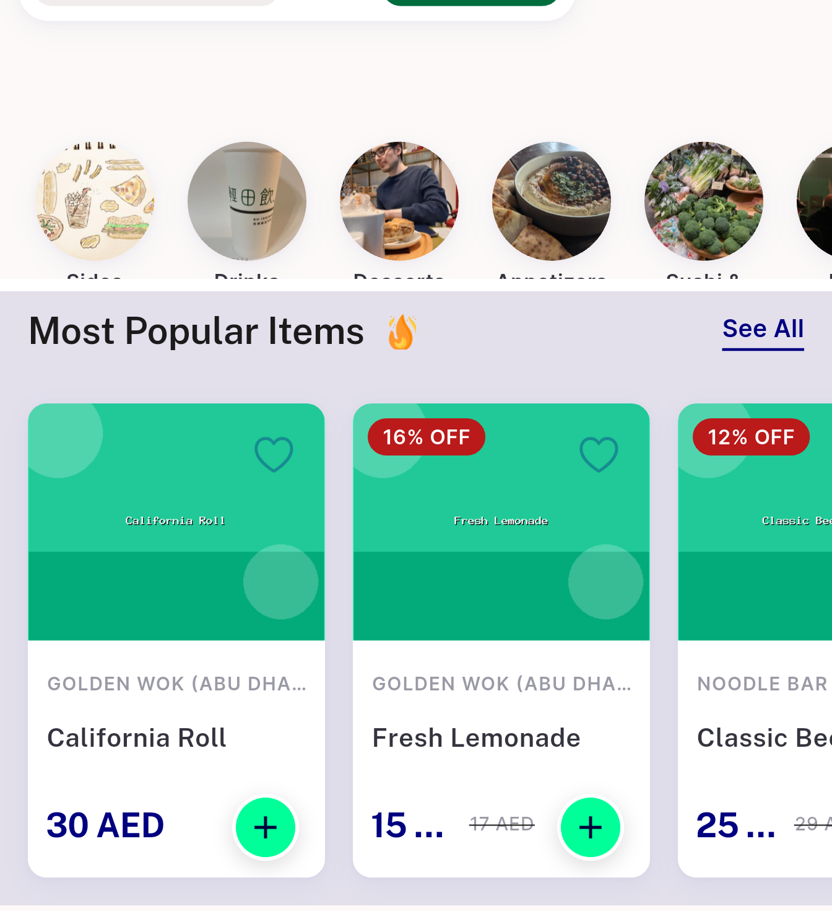

# QA Evidence — NEARS-2204

**Investigated live -- confirmed root cause is seed/demo-data (auto-generated placeholder product photos), NOT a UserApp code defect. Zero code change.**

**3 screenshot(s).** Click any thumbnail for full resolution.

<table>
<tr>
<td align="center" width="33%"> comparison category vs item552 smashburger</td>
<td align="center" width="33%"> comparison category vs most popular</td>
<td align="center" width="33%"> food home sector landing</td>
</tr>
</table>

---
*From `nears/docs/qa-evidence/NEARS-2204/` · public-repo scrub policy (no live secrets; verified clean).*
