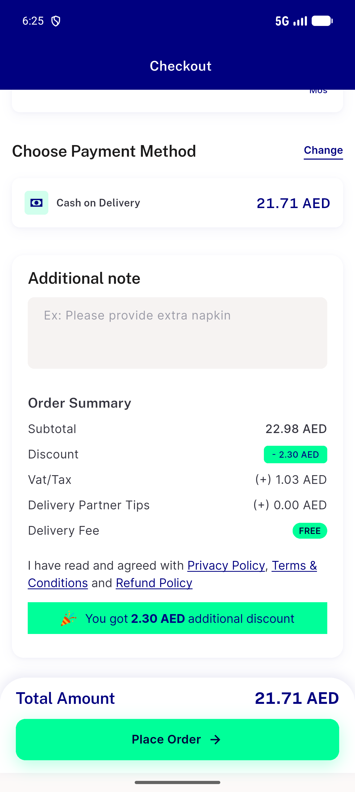
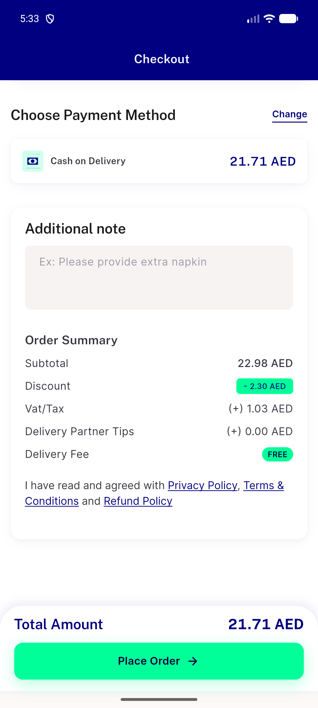
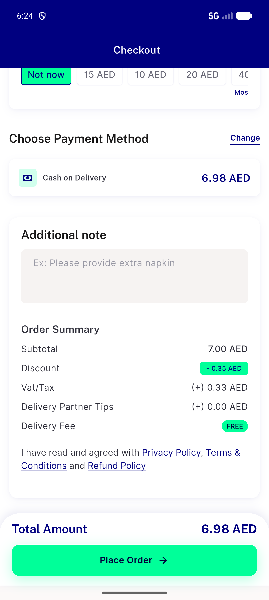
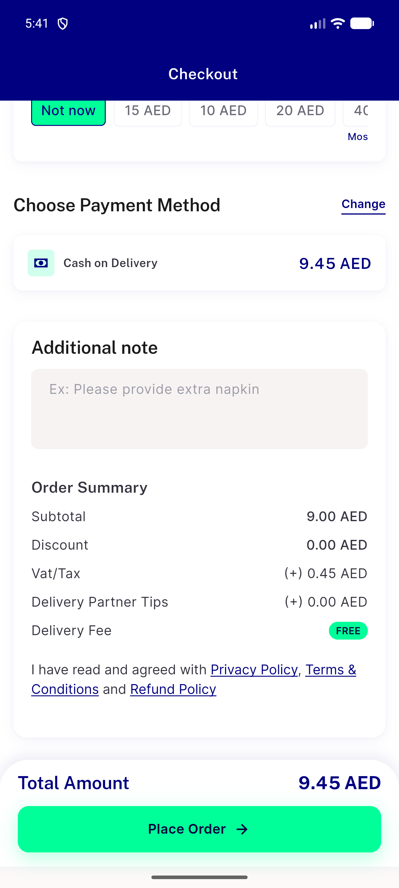

# QA Evidence — NEARS-2212

**PASS (delta re-QA cycle 1) — AC3 extra-discount banner now renders live, AC1/AC2 unaffected, no regressions**

**4 screenshot(s).** Click any thumbnail for full resolution.

<table>
<tr>
<td align="center" width="33%"> ac3 extra discount banner nears mart</td>
<td align="center" width="33%"> bug extra discount row not rendering</td>
<td align="center" width="33%"> regression fresh mart no extra discount banner</td>
</tr>
<tr>
<td align="center" width="33%"> regression store2 no discount checkout</td>
</tr>
</table>

### Other artifacts
- [`ac3-extra-discount-banner-nears-mart-a11y-dump.xml`](ac3-extra-discount-banner-nears-mart-a11y-dump.xml)
- [`bug-distance-api-shape-fallback.log`](bug-distance-api-shape-fallback.log)
- [`bug-extra-discount-row-empty-dump.xml`](bug-extra-discount-row-empty-dump.xml)
- [`regression-fresh-mart-no-banner-a11y-dump.xml`](regression-fresh-mart-no-banner-a11y-dump.xml)
- [`regression-store2-dump.xml`](regression-store2-dump.xml)

---
*From `nears/docs/qa-evidence/NEARS-2212/` · public-repo scrub policy (no live secrets; verified clean).*
