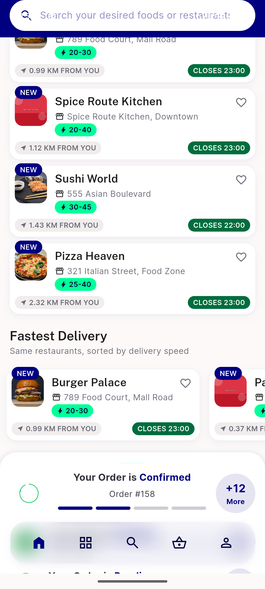
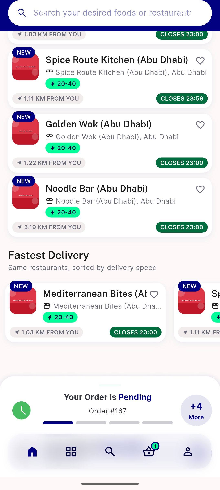

# QA Evidence — NEARS-2216

**PASS — Best Reviewed Items rail renders in zone1+zone2 (2 accounts), post-hardening build, clean logs**

**2 screenshot(s).** Click any thumbnail for full resolution.

<table>
<tr>
<td align="center" width="33%"> ac1 zone1 customer best reviewed</td>
<td align="center" width="33%"> ac1 zone2 james wilson best reviewed</td>
</tr>
</table>

### Other artifacts
- [`bug-facebook-graphresponse-app-deleted.log`](bug-facebook-graphresponse-app-deleted.log)

---
*From `nears/docs/qa-evidence/NEARS-2216/` · public-repo scrub policy (no live secrets; verified clean).*
