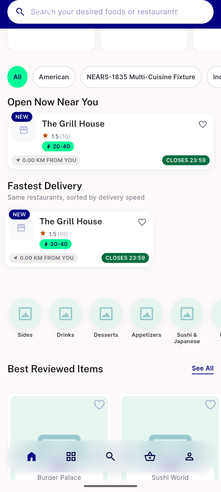
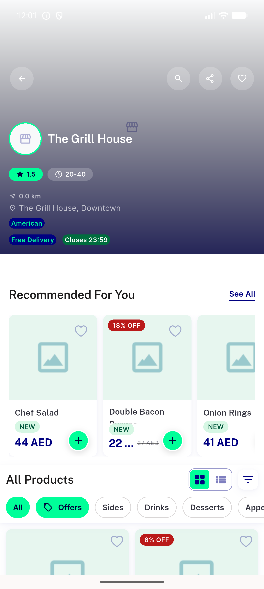
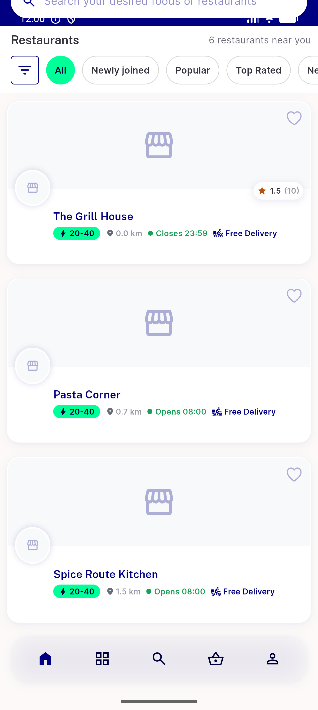

# QA Evidence — NEARS-2217

**PASS — store schedule midnight boundary fix verified live (AC1/AC2 unit-pinned green, AC3 live-rendered)**

**3 screenshot(s).** Click any thumbnail for full resolution.

<table>
<tr>
<td align="center" width="33%"> ac3 food home open now first minute</td>
<td align="center" width="33%"> ac3 store detail item cards first minute</td>
<td align="center" width="33%"> regression server open path crosscheck</td>
</tr>
</table>

---
*From `nears/docs/qa-evidence/NEARS-2217/` · public-repo scrub policy (no live secrets; verified clean).*
