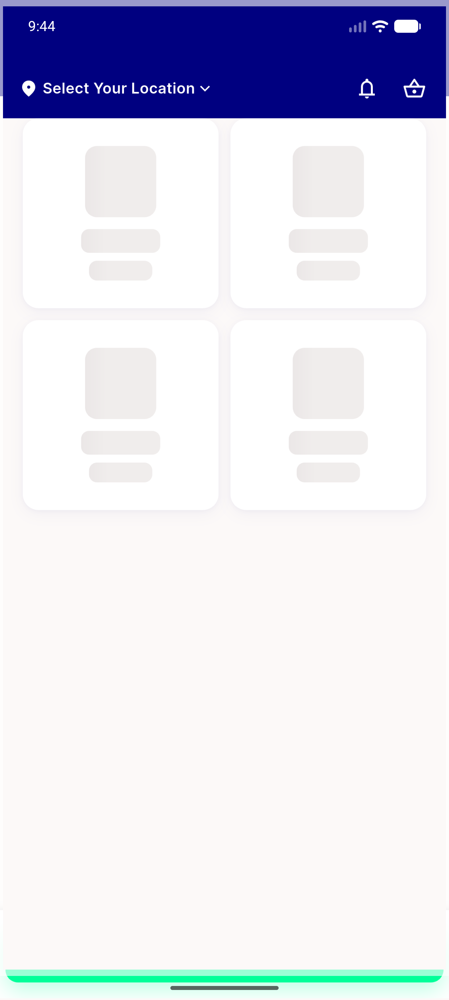

# QA Evidence — NEARS-2223

**FAIL - registration_nonce wiped by pre-existing Store::saved cache:clear side effect; AC2/AC3/F1 fail live under real config**

**2 screenshot(s).** Click any thumbnail for full resolution.

<table>
<tr>
<td align="center" width="33%"> bug nonce wiped choose plan</td>
<td align="center" width="33%"> bug nonce wiped silent 401 home</td>
</tr>
</table>

### Other artifacts
- [`bug-log-info-level-swallowed.log`](bug-log-info-level-swallowed.log)
- [`bug-nonce-wiped-by-store-saved-observer.log`](bug-nonce-wiped-by-store-saved-observer.log)
- [`progress.md`](progress.md)

---
*From `nears/docs/qa-evidence/NEARS-2223/` · public-repo scrub policy (no live secrets; verified clean).*
