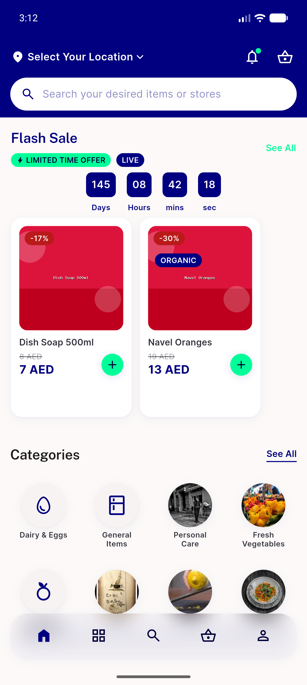
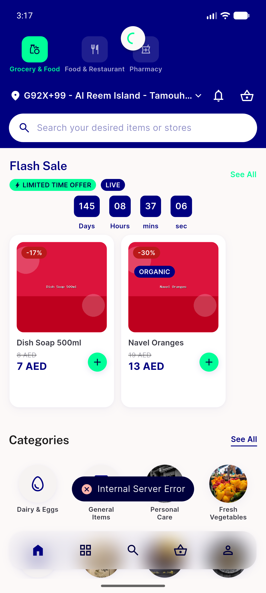

# QA Evidence — NEARS-2224

**PASS — client-side authz-401 force-logout guard, AC1 live-verified, AC2 mechanism-proof, AC3 live snackbar**

**2 screenshot(s).** Click any thumbnail for full resolution.

<table>
<tr>
<td align="center" width="33%"> ac1 force logout guest state</td>
<td align="center" width="33%"> ac3 existing error snackbar</td>
</tr>
</table>

---
*From `nears/docs/qa-evidence/NEARS-2224/` · public-repo scrub policy (no live secrets; verified clean).*
