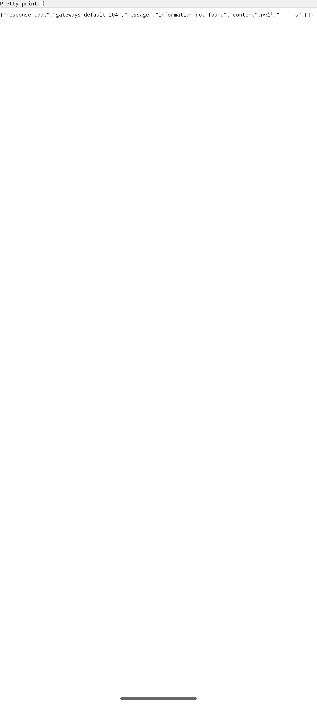

# QA Evidence — NEARS-2235

**cycle1 delta re-QA AC3 PASS — wallet Add Fund navigates cleanly into InAppBrowserActivity payment screen with non-&-bearing amount (25 AED), Uri.encodeComponent fix in place, no [FAIL]/[ERR] in FE log**

**1 screenshot(s).** Click any thumbnail for full resolution.

<table>
<tr>
<td align="center" width="33%"> ac3 wallet addfund payment screen</td>
</tr>
</table>

---
*From `nears/docs/qa-evidence/NEARS-2235/` · public-repo scrub policy (no live secrets; verified clean).*
