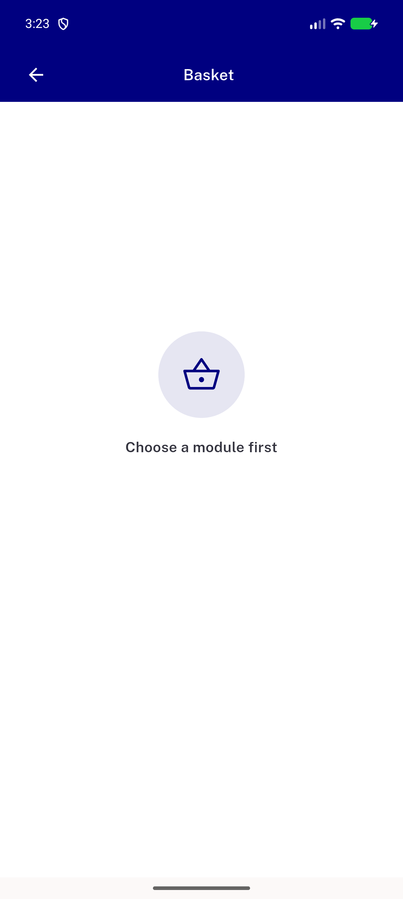
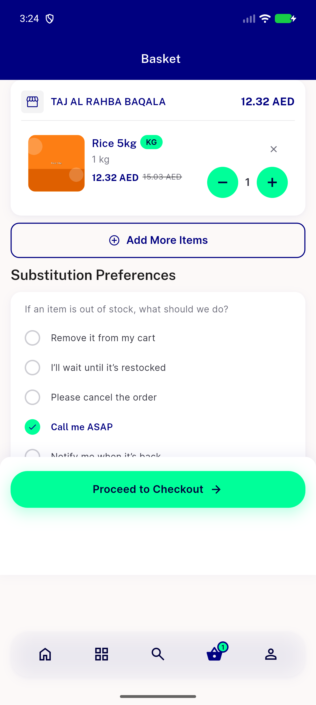
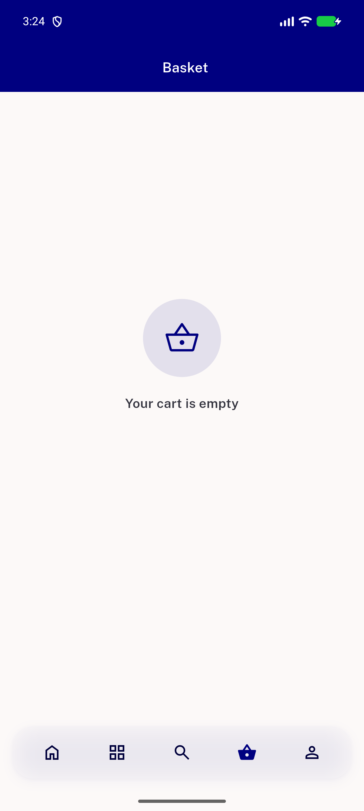
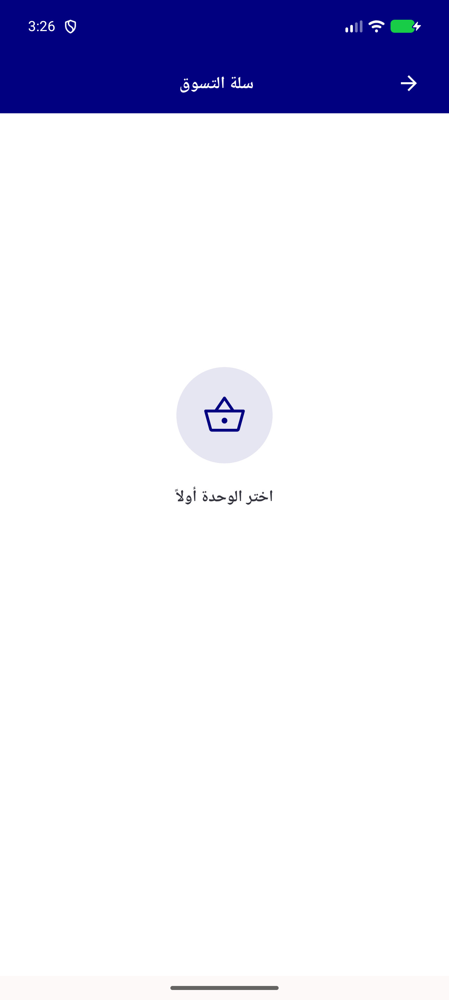

# QA Evidence — NEARS-2247

**PASS - all 3 ACs + regression + RTL demonstrated live on emulator-5560**

**4 screenshot(s).** Click any thumbnail for full resolution.

<table>
<tr>
<td align="center" width="33%"> ac1 moduleless cart</td>
<td align="center" width="33%"> ac2 sector sync</td>
<td align="center" width="33%"> regression empty cart module selected</td>
</tr>
<tr>
<td align="center" width="33%"> rtl moduleless cart</td>
</tr>
</table>

---
*From `nears/docs/qa-evidence/NEARS-2247/` · public-repo scrub policy (no live secrets; verified clean).*
