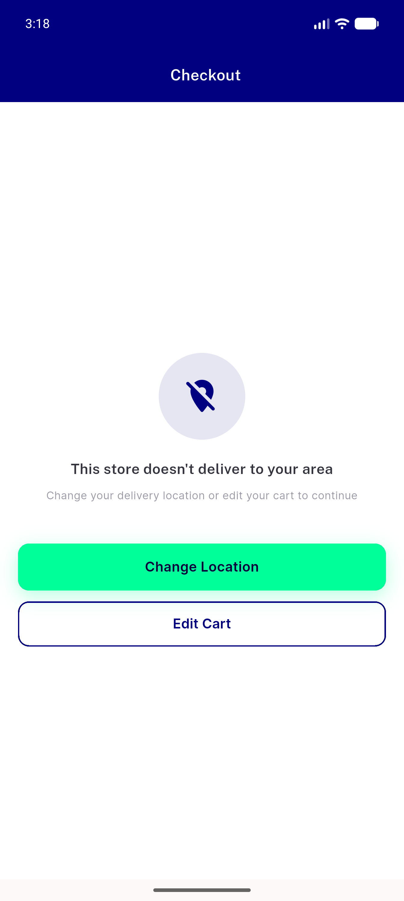

# QA Evidence — NEARS-2249

**PASS — out-of-zone [FAIL] pairing confirmed live, checkout panel renders correctly**

**1 screenshot(s).** Click any thumbnail for full resolution.

<table>
<tr>
<td align="center" width="33%"> checkout out of zone panel</td>
</tr>
</table>

### Other artifacts
- [`fail-pairing.log`](fail-pairing.log)

---
*From `nears/docs/qa-evidence/NEARS-2249/` · public-repo scrub policy (no live secrets; verified clean).*
