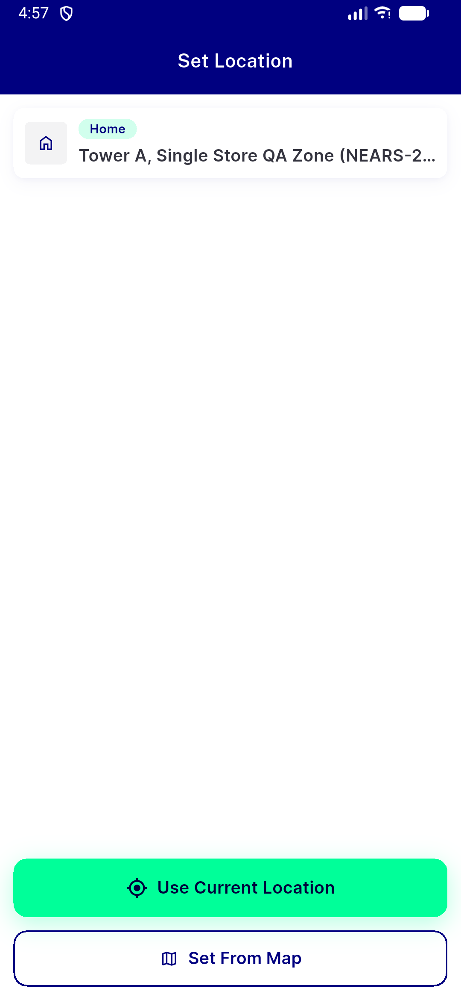

# QA Evidence — NEARS-2250

**PASS (delta, fix-cycle 3) — NEARS-2490 cart/list cross-user moduleId leak CONFIRMED FIXED live**

**2 screenshot(s).** Click any thumbnail for full resolution.

<table>
<tr>
<td align="center" width="33%"> ac3 deeplink 1714 post clear home</td>
<td align="center" width="33%"> ac3 zone warning reset post clear</td>
</tr>
</table>

### Other artifacts
- [`ac1-ac2-post-logout-header-still-leaks.log`](ac1-ac2-post-logout-header-still-leaks.log)
- [`ac1-delta3-fix2490-confirmed-no-bleed.log`](ac1-delta3-fix2490-confirmed-no-bleed.log)
- [`ac1-logout-preserves-scoped-pref.log`](ac1-logout-preserves-scoped-pref.log)
- [`ac1-scenario2-no-bleed-different-account.log`](ac1-scenario2-no-bleed-different-account.log)
- [`ac1-scenario3-guest-no-inheritance.log`](ac1-scenario3-guest-no-inheritance.log)
- [`ac2-relogin-continuity-and-handoff-fix.log`](ac2-relogin-continuity-and-handoff-fix.log)
- [`ac2-scenario5-no-remembered-number.log`](ac2-scenario5-no-remembered-number.log)
- [`ac3-deeplink-1714-logcat-excerpt.log`](ac3-deeplink-1714-logcat-excerpt.log)
- [`ac3-regression-spotcheck-deeplink-1714.log`](ac3-regression-spotcheck-deeplink-1714.log)
- [`ac3-wire-capture-full.log`](ac3-wire-capture-full.log)
- [`bug-cachemodule-cross-user-cartlist-leak.log`](bug-cachemodule-cross-user-cartlist-leak.log)
- [`bug-clearshareddata-header-rebuild-order.log`](bug-clearshareddata-header-rebuild-order.log)
- [`delta3-fix2490-wire-capture-full.log`](delta3-fix2490-wire-capture-full.log)
- [`full-wire-capture.log`](full-wire-capture.log)

---
*From `nears/docs/qa-evidence/NEARS-2250/` · public-repo scrub policy (no live secrets; verified clean).*
