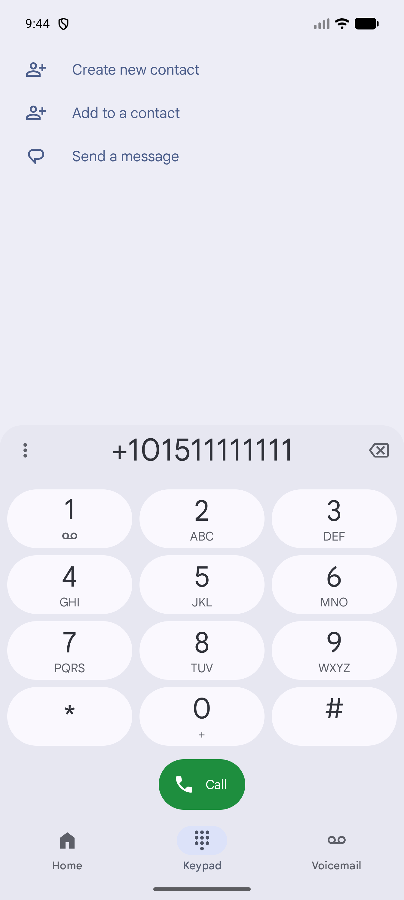
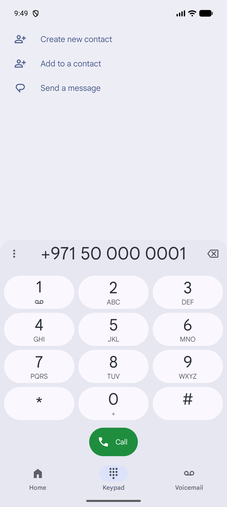
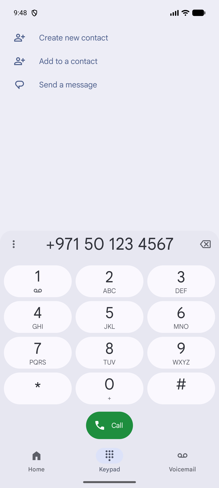
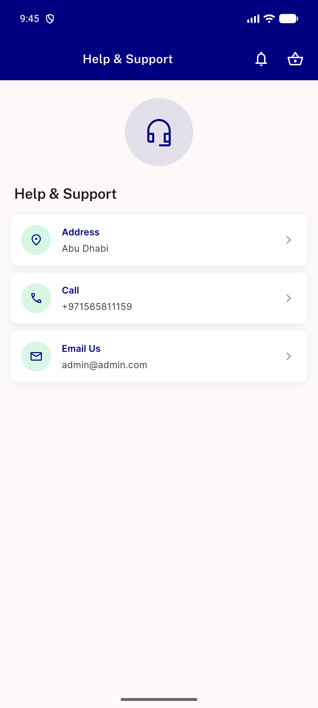

# QA Evidence — NEARS-2256

**PASS — tel:/mailto: null-guard sweep: footer mailto guard, DeliveryApp store+customer call guards, UserApp order-details store call guard all verified (widget tests + live device); support/VendorApp regression confirmed clean**

**4 screenshot(s).** Click any thumbnail for full resolution.

<table>
<tr>
<td align="center" width="33%"> ac1 store call dials</td>
<td align="center" width="33%"> ac2 deliveryapp customer call dials</td>
<td align="center" width="33%"> ac2 deliveryapp store call dials</td>
</tr>
<tr>
<td align="center" width="33%"> regression support screen</td>
</tr>
</table>

---
*From `nears/docs/qa-evidence/NEARS-2256/` · public-repo scrub policy (no live secrets; verified clean).*
