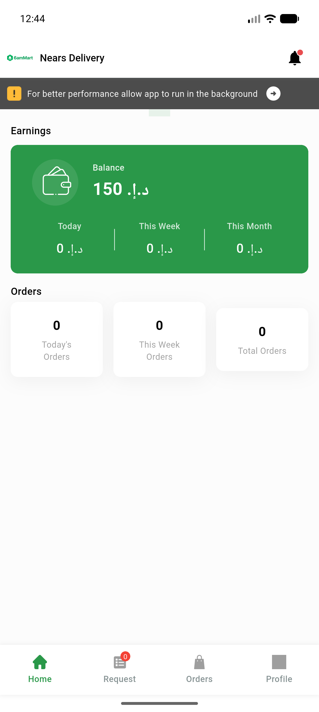
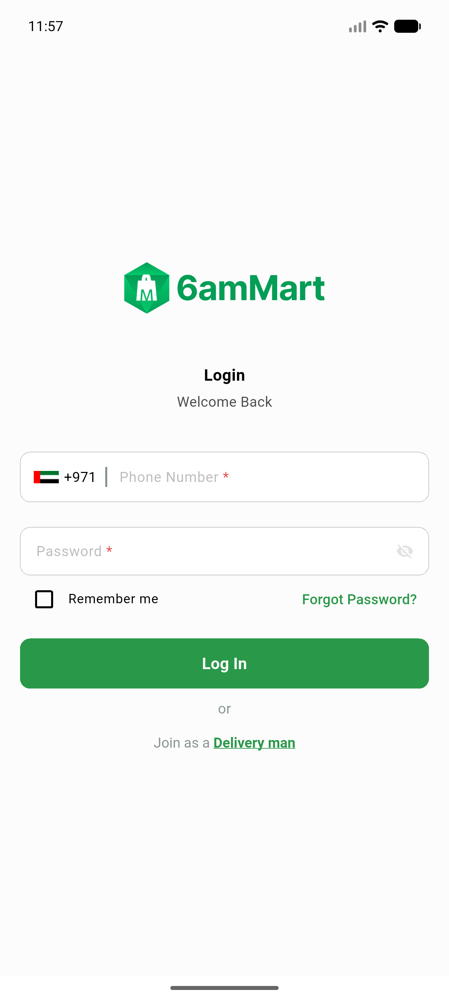
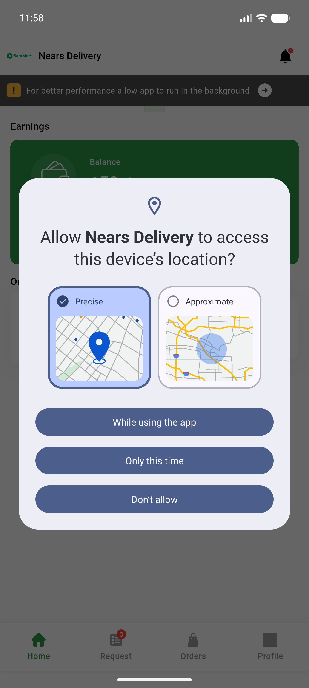
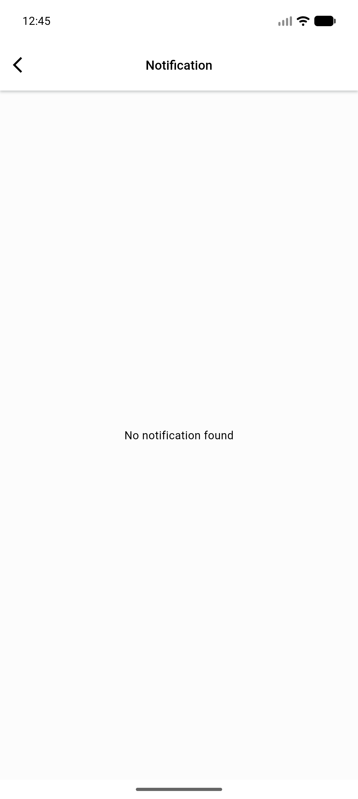
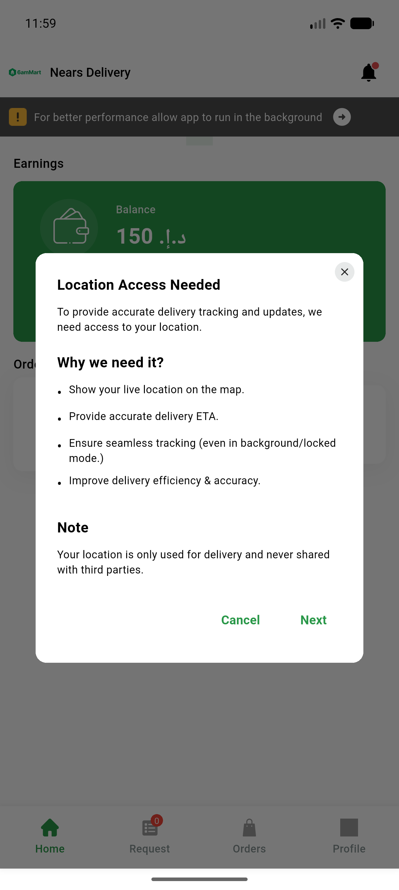
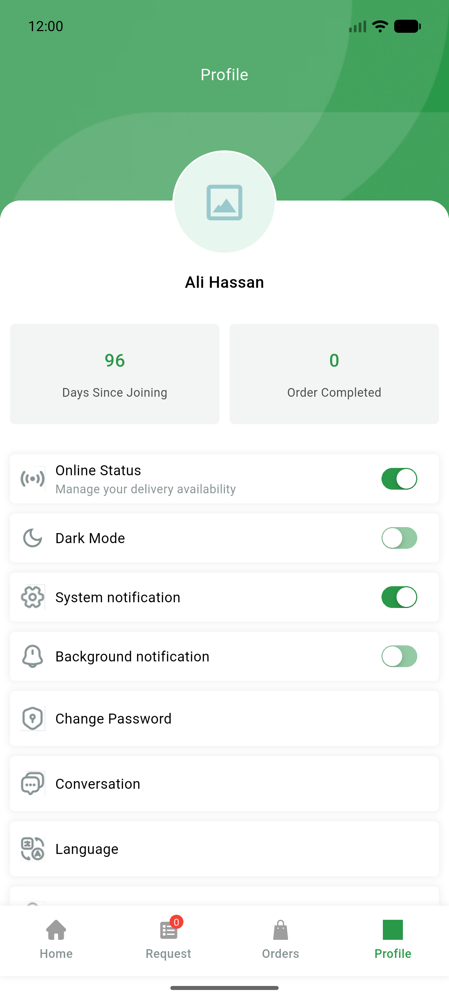
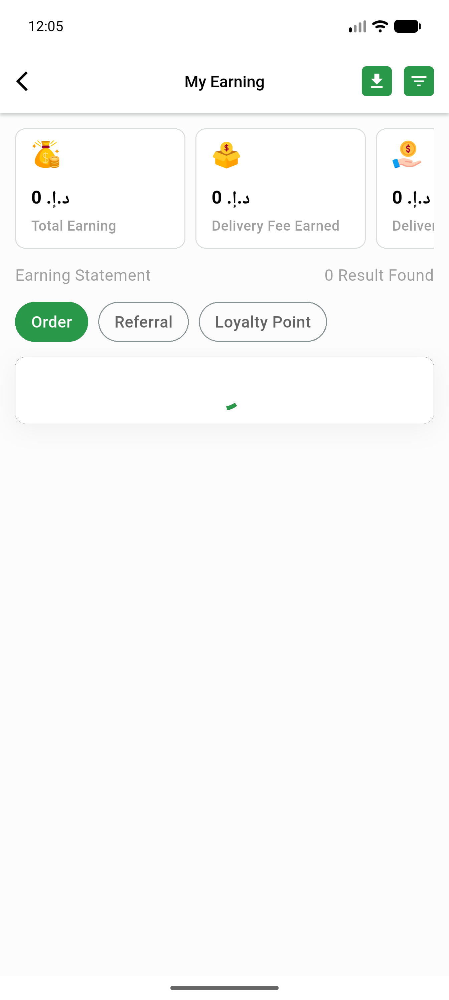

# QA Evidence — NEARS-226

**7 screenshot(s).** Click any thumbnail for full resolution.

<table>
<tr>
<td align="center" width="33%"> delivery home</td>
<td align="center" width="33%"> signin</td>
<td align="center" width="33%"> dashboard</td>
</tr>
<tr>
<td align="center" width="33%"> notifications screen</td>
<td align="center" width="33%"> dashboard clean</td>
<td align="center" width="33%"> profile</td>
</tr>
<tr>
<td align="center" width="33%"> my earning</td>
</tr>
</table>

### Other artifacts
- [`events_verified_live.txt`](events_verified_live.txt)
- [`logcat_coldstart_appopen_screenview.txt`](logcat_coldstart_appopen_screenview.txt)
- [`logcat_events.txt`](logcat_events.txt)

---
*From `nears/docs/qa-evidence/NEARS-226/` · public-repo scrub policy (no live secrets; verified clean).*
