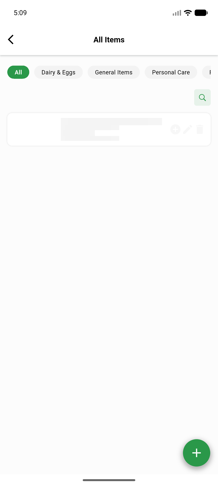
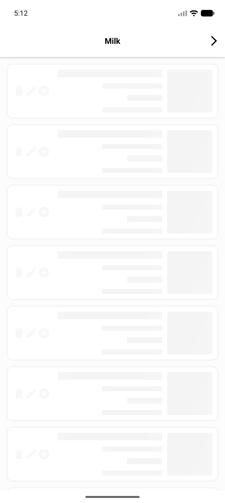
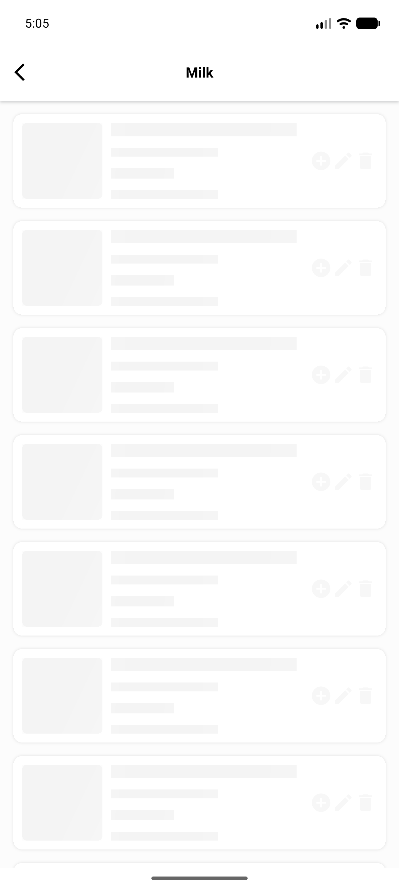

# QA Evidence — NEARS-2261

**PASS - VendorApp NEARS-2261 rating-count RTL fix, emulator-5556**

**3 screenshot(s).** Click any thumbnail for full resolution.

<table>
<tr>
<td align="center" width="33%"> bug vendor itemlist parse allitems en blocked</td>
<td align="center" width="33%"> bug vendor itemlist parse milk ar blocked</td>
<td align="center" width="33%"> bug vendor itemlist parse milk en blocked</td>
</tr>
</table>

### Other artifacts
- [`ac-widget-test-rating-badge.log`](ac-widget-test-rating-badge.log)
- [`bug-vendor-itemlist-parse.log`](bug-vendor-itemlist-parse.log)

---
*From `nears/docs/qa-evidence/NEARS-2261/` · public-repo scrub policy (no live secrets; verified clean).*
