# QA Evidence — NEARS-2264

**PASS — 6/6 ACs met; suite 4034 visible / 4034 pass / 0 fail; live UserApp on emulator-5554, light mode, en+ar**

**17 screenshot(s).** Click any thumbnail for full resolution.

<table>
<tr>
<td align="center" width="33%"><a href="ac-01-home-grocery.png">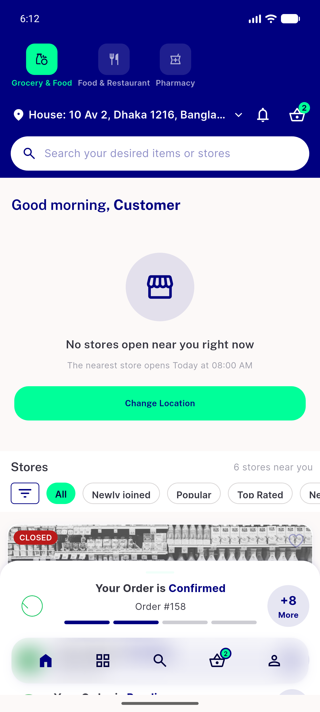</a> ac 01 home grocery</td>
<td align="center" width="33%"><a href="ac-02-order-tracking.png">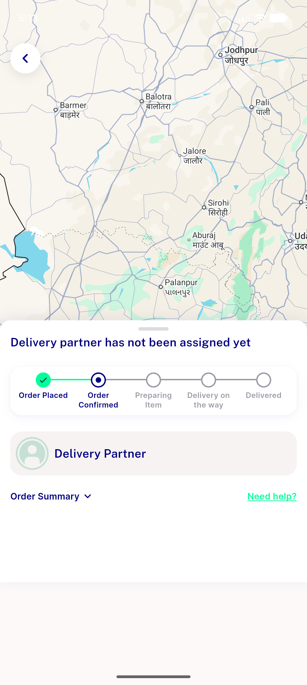</a> ac 02 order tracking</td>
<td align="center" width="33%"><a href="ac-03-order-summary.png">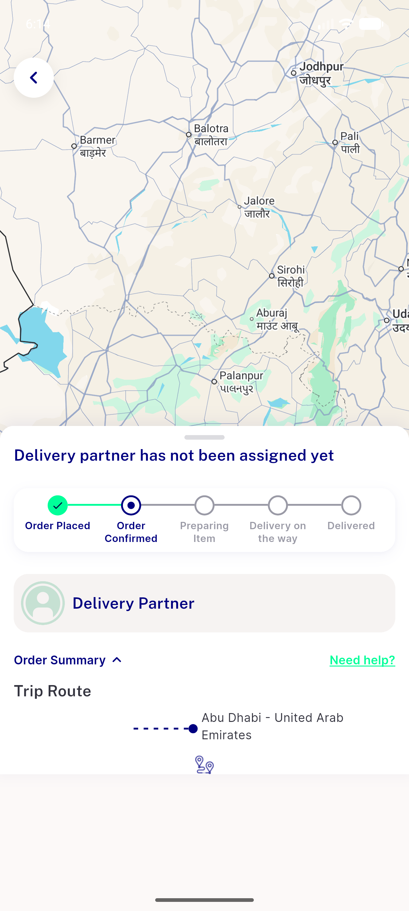</a> ac 03 order summary</td>
</tr>
<tr>
<td align="center" width="33%"><a href="ac-04-cart.png">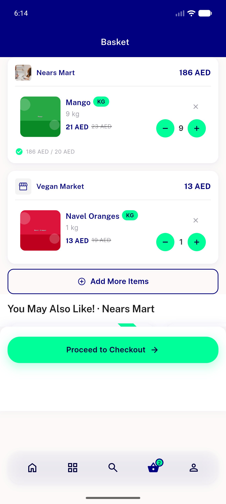</a> ac 04 cart</td>
<td align="center" width="33%"><a href="ac-05a-checkout-items.png">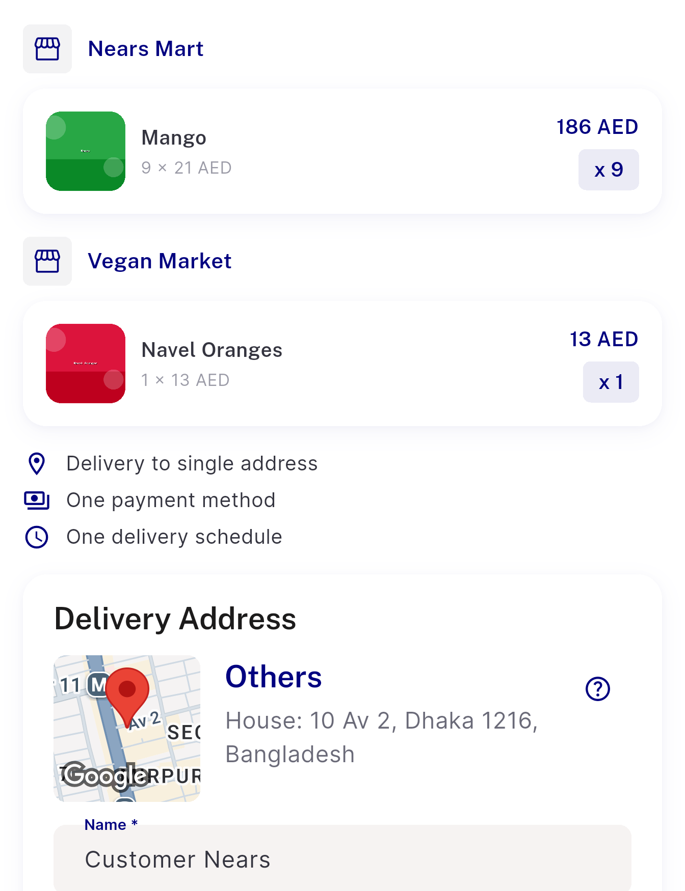</a> ac 05a checkout items</td>
<td align="center" width="33%"><a href="ac-05b-checkout-total.png">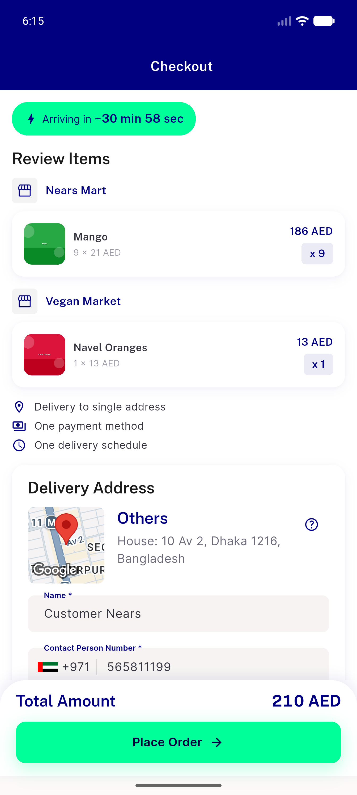</a> ac 05b checkout total</td>
</tr>
<tr>
<td align="center" width="33%"><a href="ac-06-item-detail-sheet.png">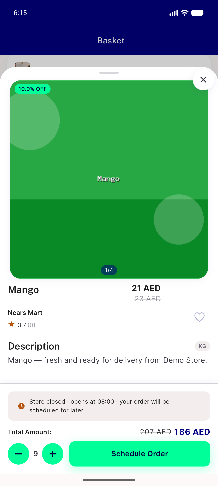</a> ac 06 item detail sheet</td>
<td align="center" width="33%"><a href="ac-07-flash-sale-grid.png">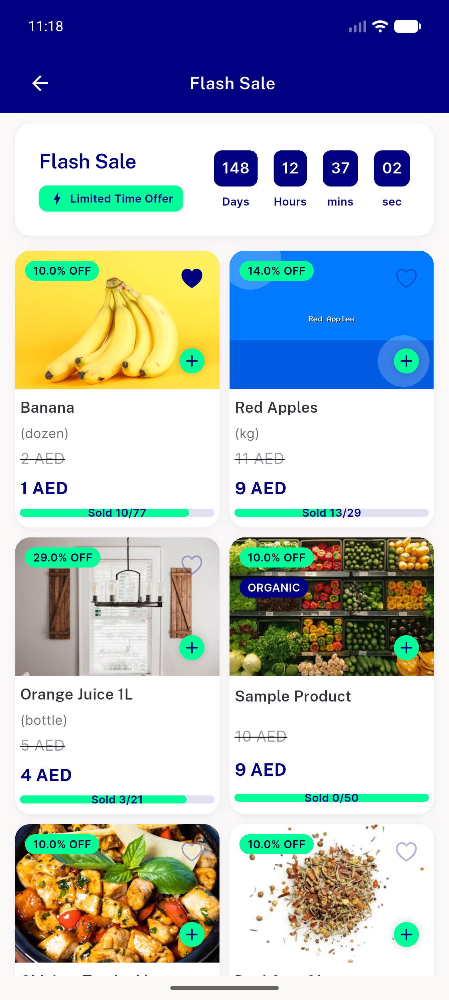</a> ac 07 flash sale grid</td>
<td align="center" width="33%"><a href="ac-08-store-reg-logo-en.png">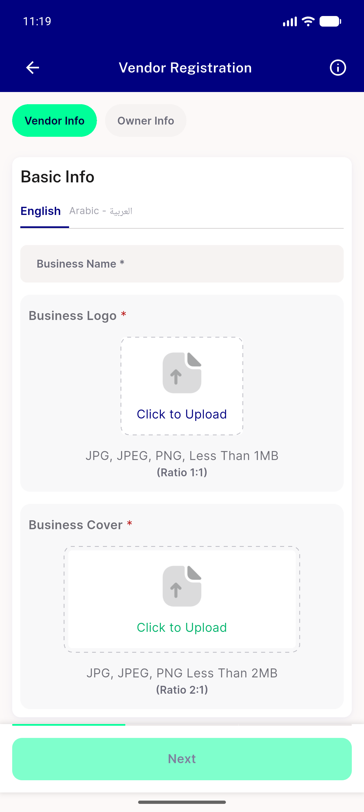</a> ac 08 store reg logo en</td>
</tr>
<tr>
<td align="center" width="33%"><a href="ac-09-store-reg-logo-en-scale130.png">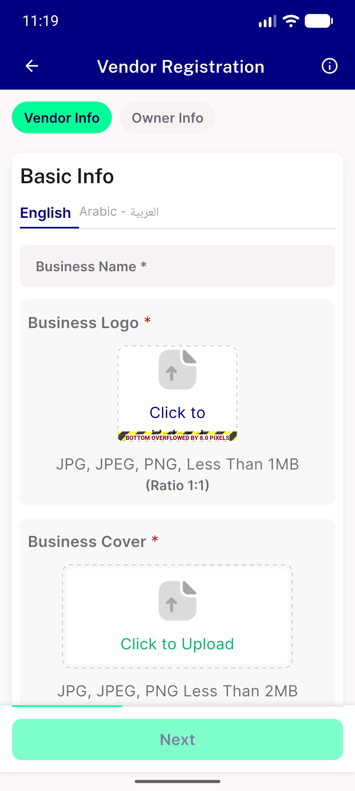</a> ac 09 store reg logo en scale130</td>
<td align="center" width="33%"><a href="ac-10-home-arabic-rtl.png">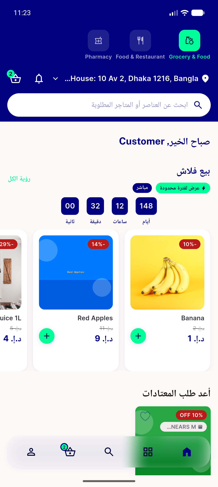</a> ac 10 home arabic rtl</td>
<td align="center" width="33%"><a href="ac-11-flash-sale-arabic-rtl.png">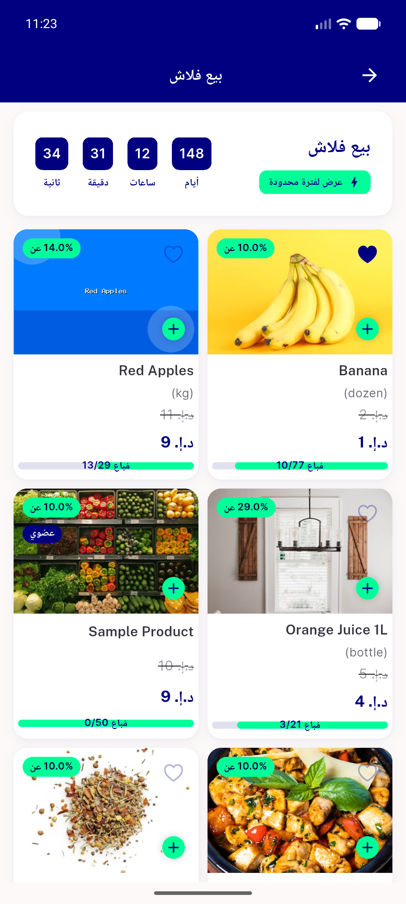</a> ac 11 flash sale arabic rtl</td>
</tr>
<tr>
<td align="center" width="33%"><a href="ac-12-store-reg-logo-arabic.png">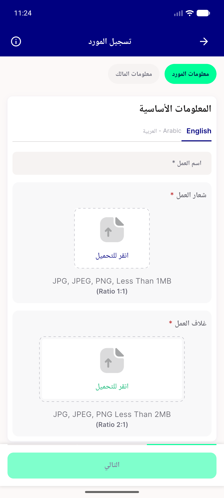</a> ac 12 store reg logo arabic</td>
<td align="center" width="33%"><a href="ac-13-cart-arabic-rtl.png">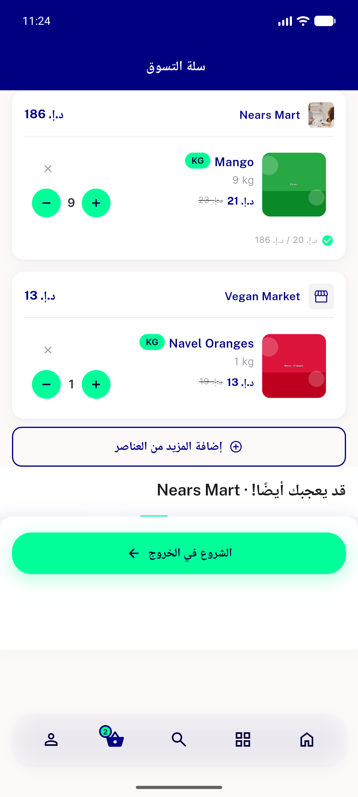</a> ac 13 cart arabic rtl</td>
<td align="center" width="33%"><a href="ac-14-store-detail-header.png">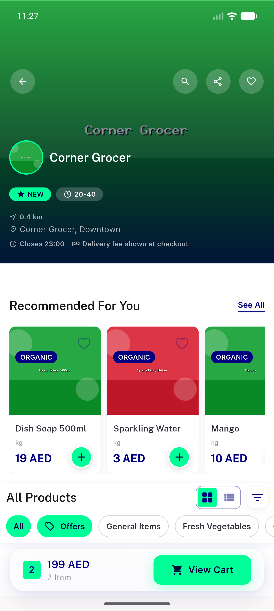</a> ac 14 store detail header</td>
</tr>
<tr>
<td align="center" width="33%"> bug filter chip descender clip</td>
<td align="center" width="33%"> bug store reg logo tile textscale130 overflow</td>
</tr>
</table>

### Other artifacts
- [`bug-api-403-404-no-failure-log.log`](bug-api-403-404-no-failure-log.log)
- [`bug-store-reg-logo-tile-textscale130-overflow.log`](bug-store-reg-logo-tile-textscale130-overflow.log)

---
*From `nears/docs/qa-evidence/NEARS-2264/` · public-repo scrub policy (no live secrets; verified clean).*
