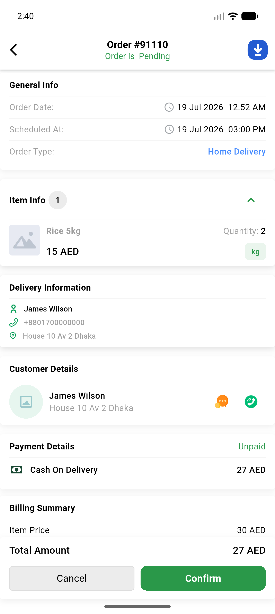

# QA Evidence — NEARS-2266

**PASS — vendor order-details customer projection (AC1/AC2 mutation-proved, AC3 no-change baseline)**

**1 screenshot(s).** Click any thumbnail for full resolution.

<table>
<tr>
<td align="center" width="33%"> ac3 vendor order details customer card 91110</td>
</tr>
</table>

### Other artifacts
- [`ac1-ac2-mutation-fix-removed-RED.log`](ac1-ac2-mutation-fix-removed-RED.log)
- [`ac1-ac2-suite-green.log`](ac1-ac2-suite-green.log)
- [`ac3-vendor-order-endpoint-prefix-vs-postfix.log`](ac3-vendor-order-endpoint-prefix-vs-postfix.log)
- [`bug-vendor-order-details-500-null-receiver-details.log`](bug-vendor-order-details-500-null-receiver-details.log)
- [`bug-vendorapp-order-details-map-foreach.log`](bug-vendorapp-order-details-map-foreach.log)
- [`bug-zone-contains-scope-missing.log`](bug-zone-contains-scope-missing.log)
- [`sweep-assertion-independent-proof-RED.log`](sweep-assertion-independent-proof-RED.log)

---
*From `nears/docs/qa-evidence/NEARS-2266/` · public-repo scrub policy (no live secrets; verified clean).*
