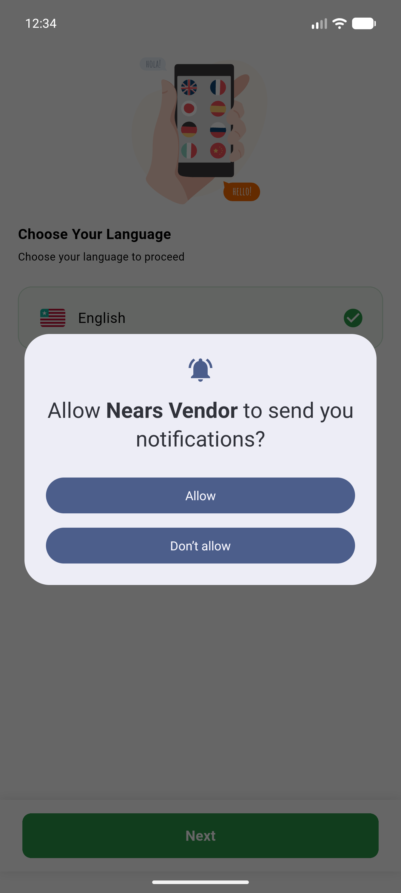
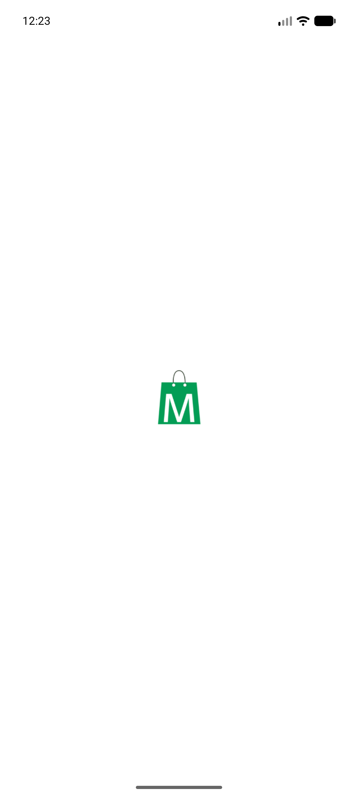
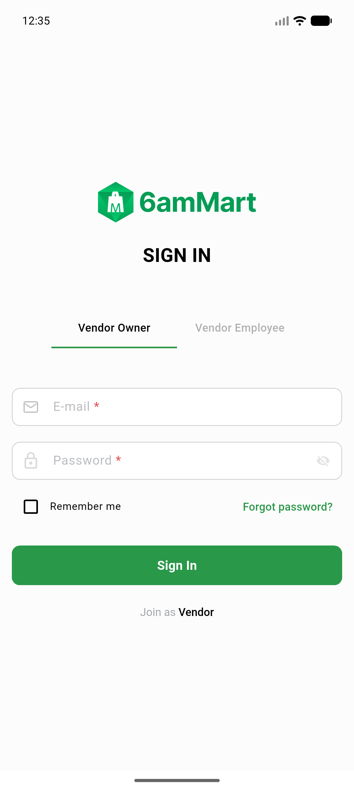
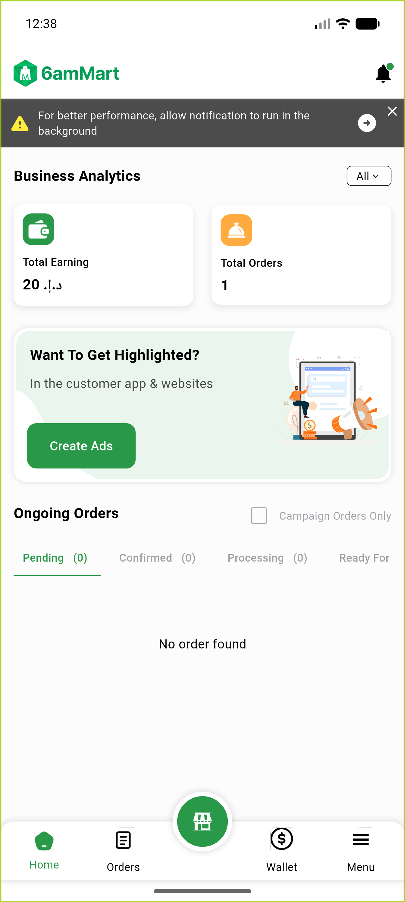
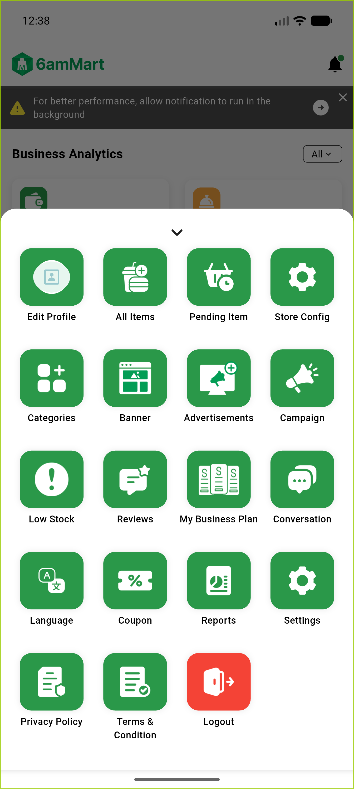
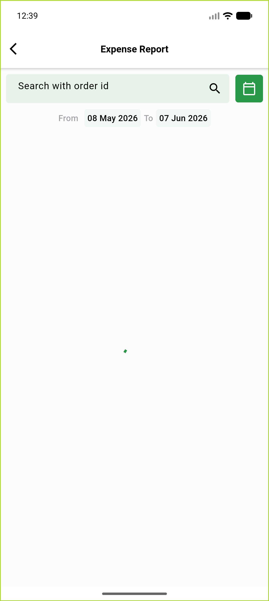
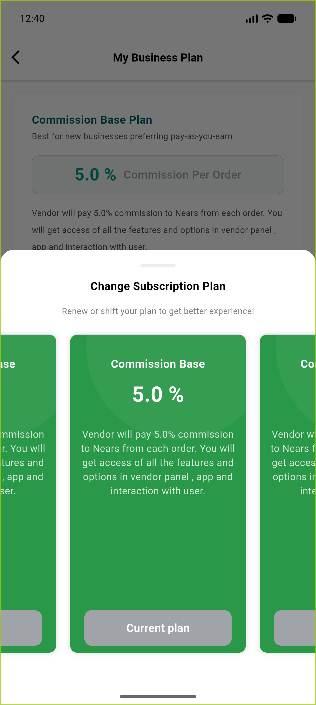

# QA Evidence — NEARS-227

**8 screenshot(s).** Click any thumbnail for full resolution.

<table>
<tr>
<td align="center" width="33%"> boot login screen</td>
<td align="center" width="33%"> current</td>
<td align="center" width="33%"> login screen</td>
</tr>
<tr>
<td align="center" width="33%"> stuck on splash</td>
<td align="center" width="33%"> dashboard</td>
<td align="center" width="33%"> menu</td>
</tr>
<tr>
<td align="center" width="33%"> report expense</td>
<td align="center" width="33%"> subscription</td>
</tr>
</table>

### Other artifacts
- [`crash_stacktrace_core_no_app.txt`](crash_stacktrace_core_no_app.txt)
- [`events_verified_live.txt`](events_verified_live.txt)

---
*From `nears/docs/qa-evidence/NEARS-227/` · public-repo scrub policy (no live secrets; verified clean).*
