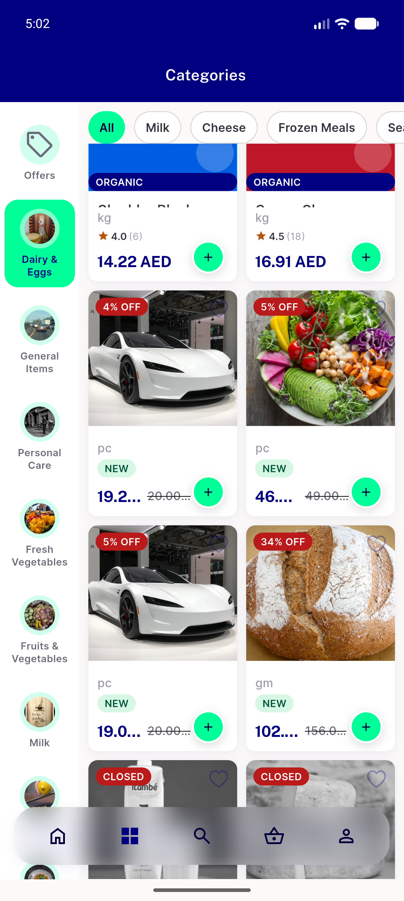
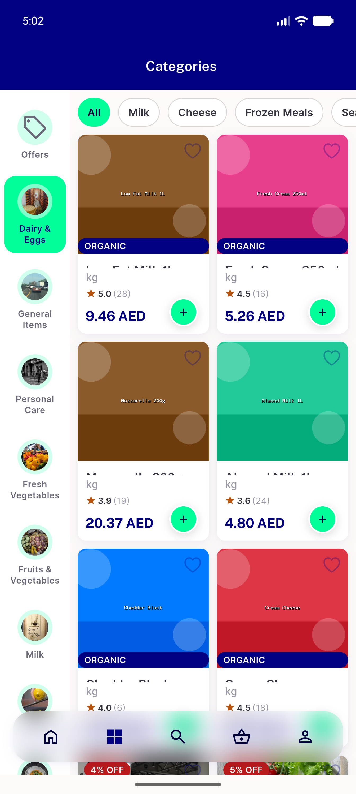
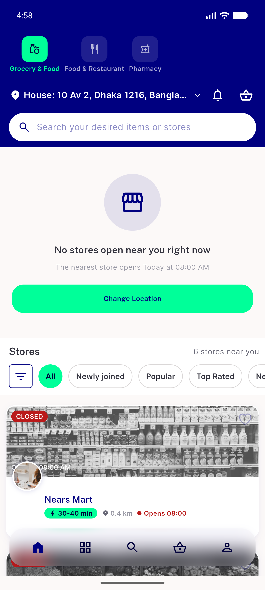
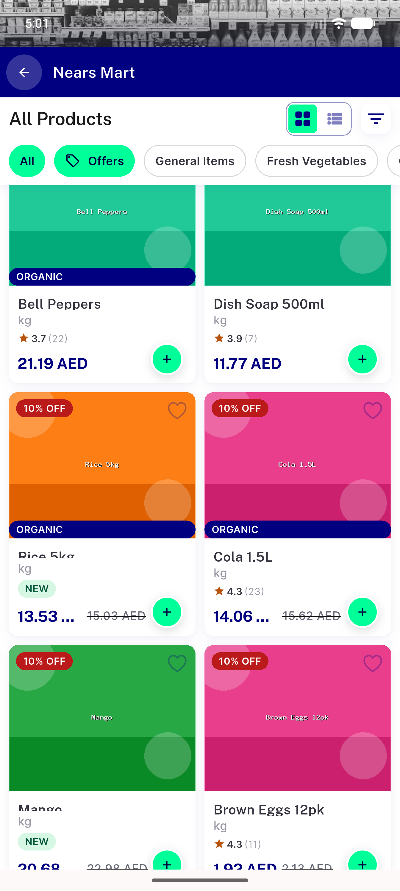
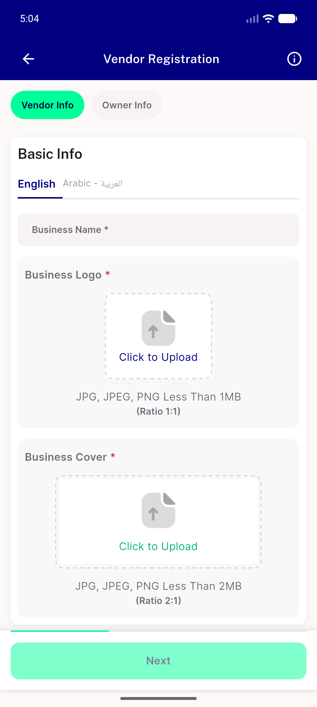
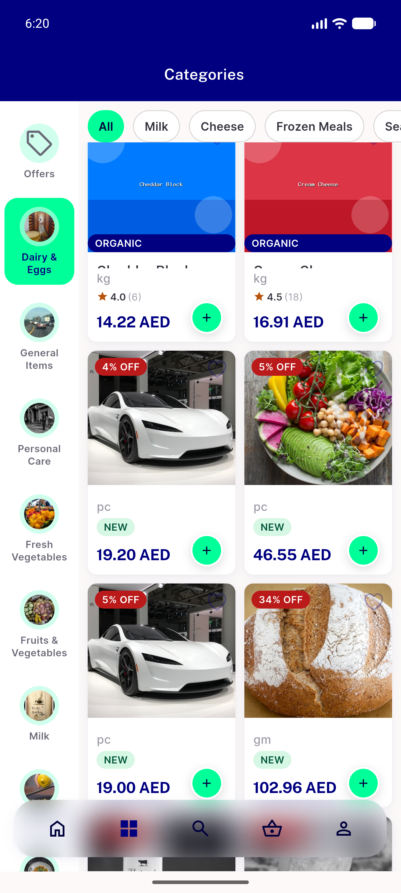
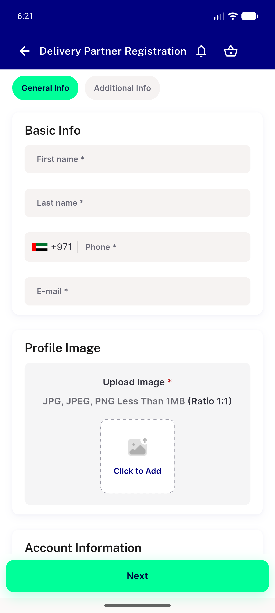
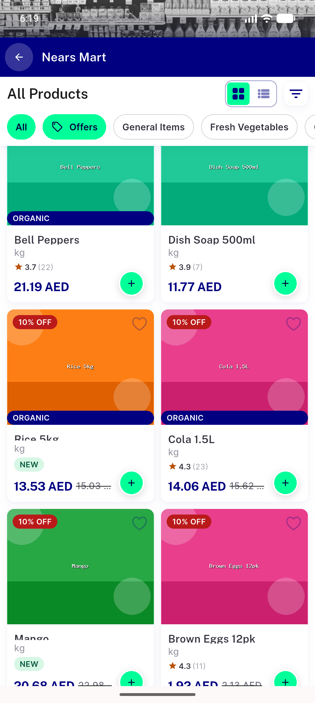
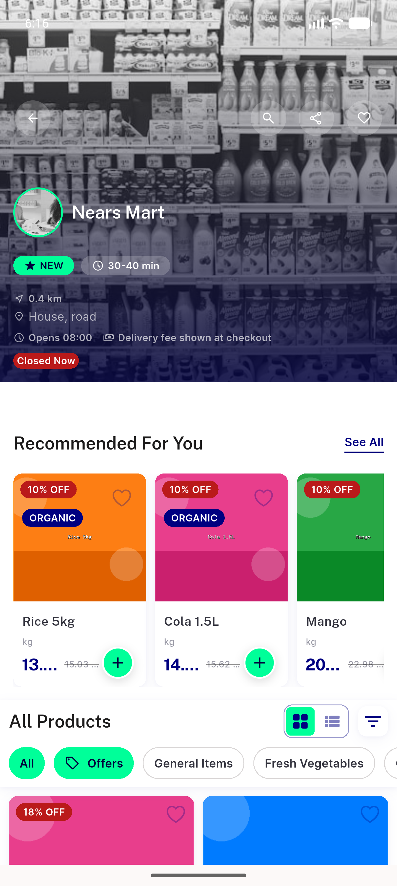

# QA Evidence — NEARS-2272

**cycle3 PASS: item_widget fix confirmed, rail truncation reattributed as out-of-scope pre-existing DLS component**

**12 screenshot(s).** Click any thumbnail for full resolution.

<table>
<tr>
<td align="center" width="33%"> ac2 category grid discounted</td>
<td align="center" width="33%"> ac2 category grid</td>
<td align="center" width="33%"> ac2 home flashsale rail</td>
</tr>
<tr>
<td align="center" width="33%"> ac2 store grid allproducts</td>
<td align="center" width="33%"> ac2 store registration tabs</td>
<td align="center" width="33%"> ac2 store screen grid</td>
</tr>
<tr>
<td align="center" width="33%"> bug item widget price truncation</td>
<td align="center" width="33%"> c3 category grid discounted</td>
<td align="center" width="33%"> c3 delivery man registration</td>
</tr>
<tr>
<td align="center" width="33%"> c3 store card with distance</td>
<td align="center" width="33%"> c3 store grid allproducts</td>
<td align="center" width="33%"> c3 store screen grid</td>
</tr>
</table>

---
*From `nears/docs/qa-evidence/NEARS-2272/` · public-repo scrub policy (no live secrets; verified clean).*
