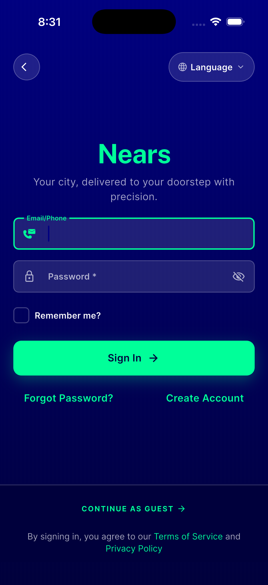
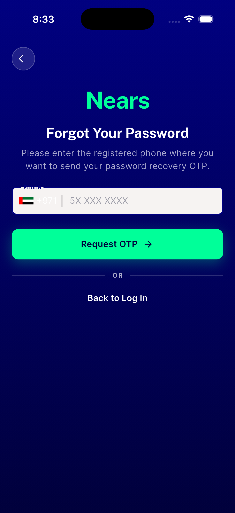
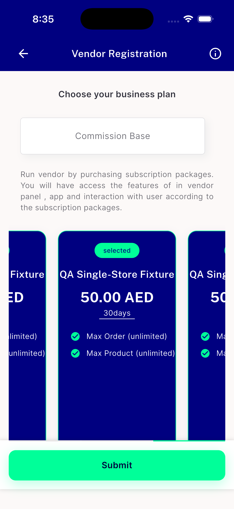
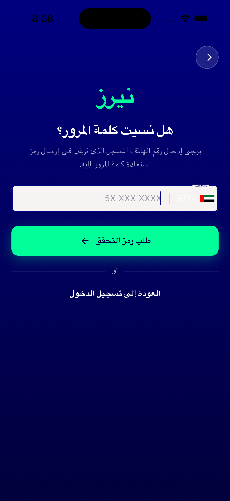
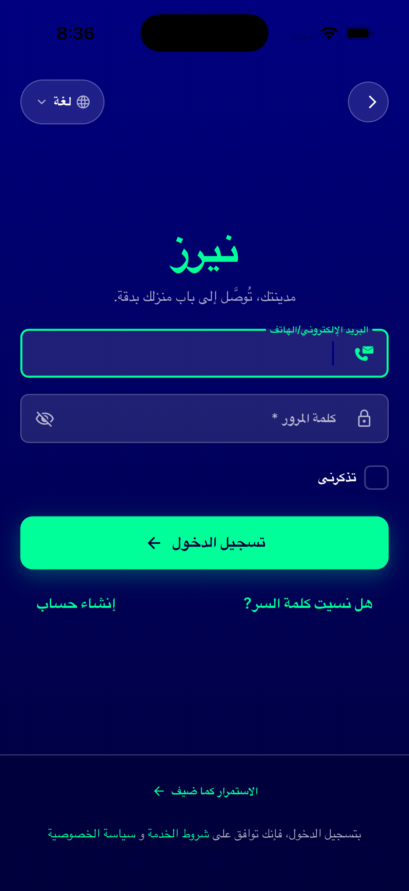

# QA Evidence — NEARS-2277

**PASS — 5-site fontSize substitution (display->headlineMd), sign_in/forget_pass/package_card live-verified iOS sim (light), RTL smoke clean, dynamic_text_color+success_widget confirmed unreachable (dead code, N/A-live), zero remaining display.fontSize sites**

**5 screenshot(s).** Click any thumbnail for full resolution.

<table>
<tr>
<td align="center" width="33%"> ac1 sign in screen wordmark</td>
<td align="center" width="33%"> ac2 forget pass screen wordmark</td>
<td align="center" width="33%"> ac3 package card widget subscription selected</td>
</tr>
<tr>
<td align="center" width="33%"> ac6 rtl forget pass</td>
<td align="center" width="33%"> ac6 rtl sign in</td>
</tr>
</table>

---
*From `nears/docs/qa-evidence/NEARS-2277/` · public-repo scrub policy (no live secrets; verified clean).*
