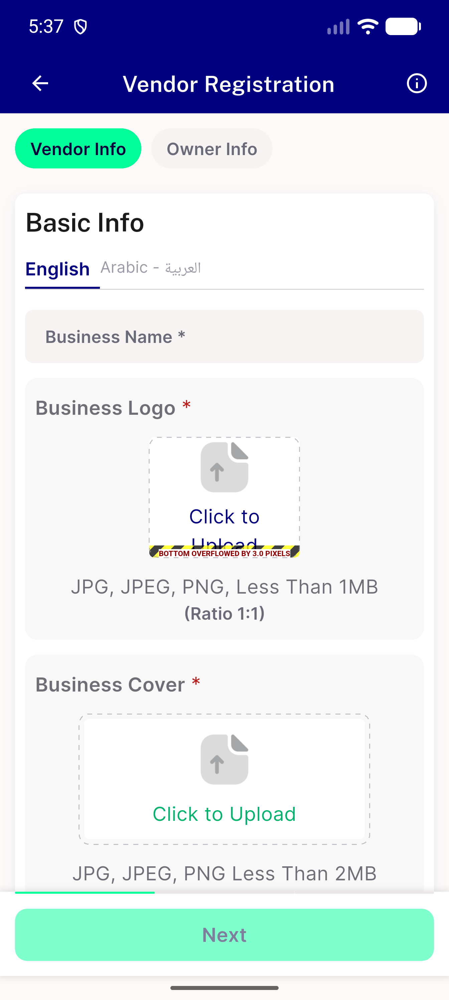

# QA Evidence — NEARS-2278

**FAIL — Business Logo tile overflow persists at textScale 1.3 (English); clean at 1.0 en/ar**

**1 screenshot(s).** Click any thumbnail for full resolution.

<table>
<tr>
<td align="center" width="33%"> ac1 textscale13 en</td>
</tr>
</table>

### Other artifacts
- [`bug-logo-tile-overflow-textscale13-en.log`](bug-logo-tile-overflow-textscale13-en.log)

---
*From `nears/docs/qa-evidence/NEARS-2278/` · public-repo scrub policy (no live secrets; verified clean).*
