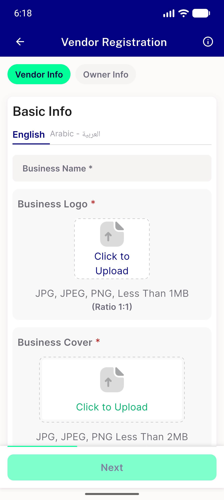

# QA Evidence — NEARS-2278

**cycle-2 delta re-QA: PASS - 3.0px logo-tile overflow closed at textScale 1.3 EN, zero overflow confirmed live**

**1 screenshot(s).** Click any thumbnail for full resolution.

<table>
<tr>
<td align="center" width="33%"> ac1 logo tile textscale13 en cycle2</td>
</tr>
</table>

---
*From `nears/docs/qa-evidence/NEARS-2278/` · public-repo scrub policy (no live secrets; verified clean).*
