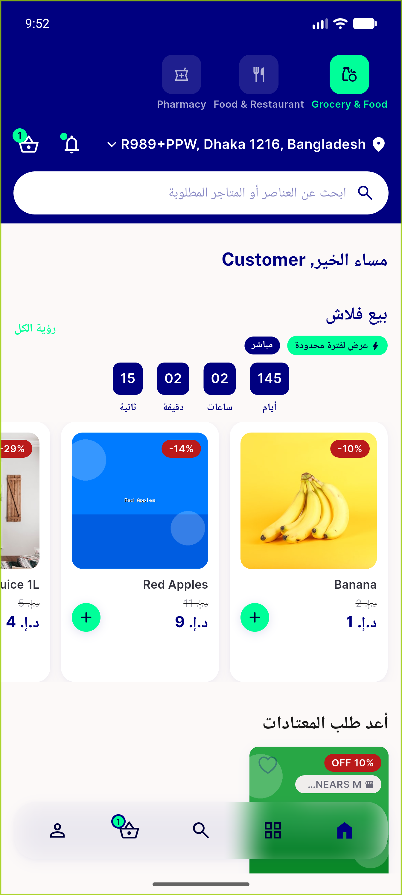
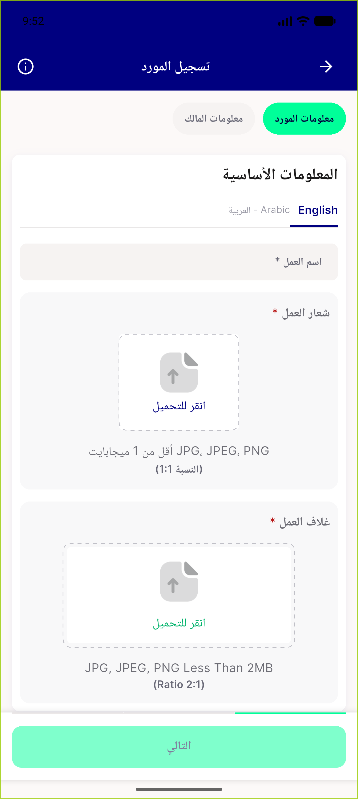
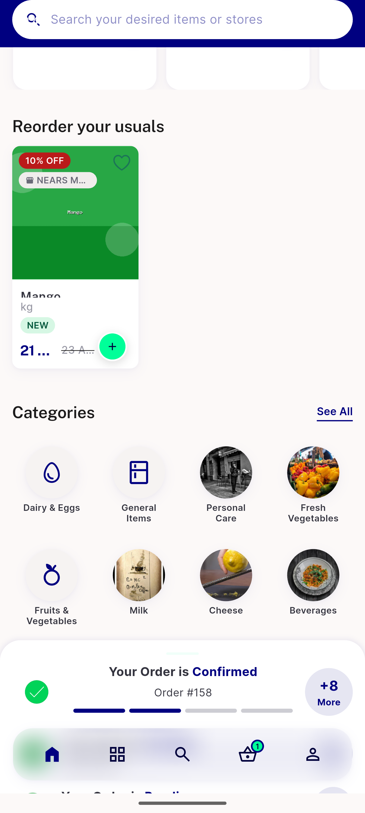
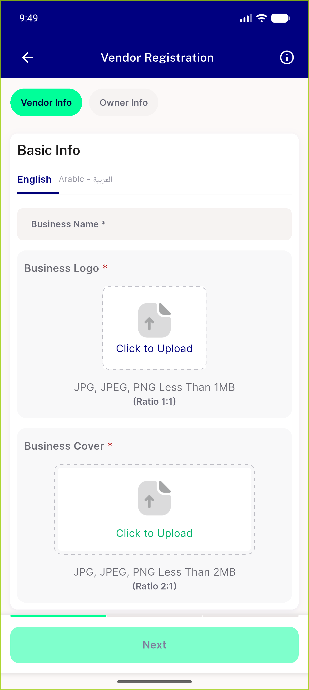

# QA Evidence — NEARS-2282

**PASS — both ACs demonstrated live in ar locale, en regression clean, 18/18 automated**

**5 screenshot(s).** Click any thumbnail for full resolution.

<table>
<tr>
<td align="center" width="33%"> ar flash sale badge</td>
<td align="center" width="33%"> ar store reg captions</td>
<td align="center" width="33%"> bug cover caption untranslated ar</td>
</tr>
<tr>
<td align="center" width="33%"> en flash sale badge</td>
<td align="center" width="33%"> en store reg captions</td>
</tr>
</table>

---
*From `nears/docs/qa-evidence/NEARS-2282/` · public-repo scrub policy (no live secrets; verified clean).*
