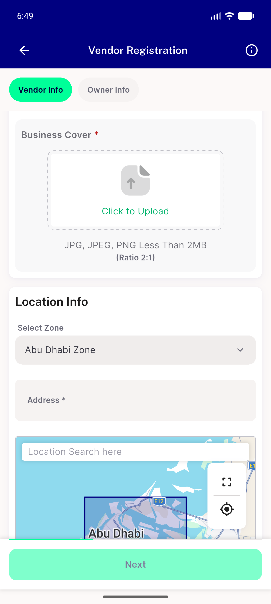
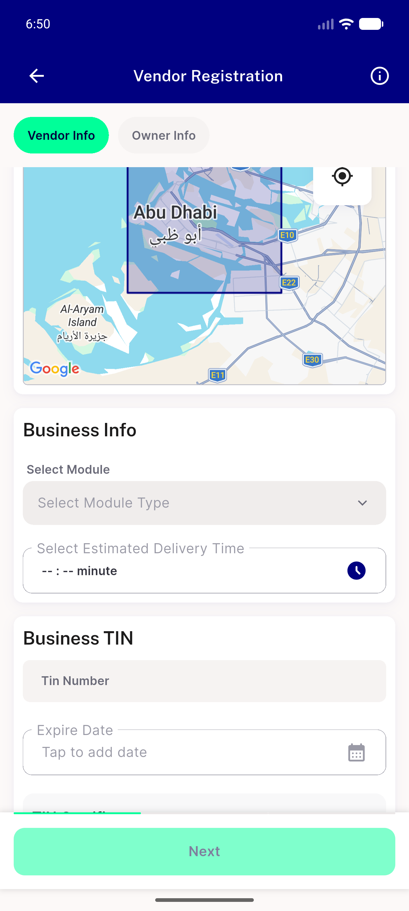
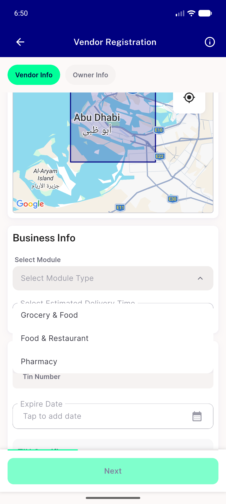
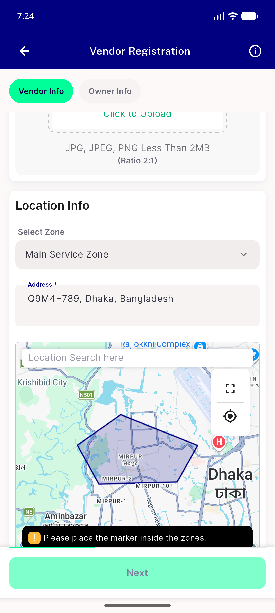
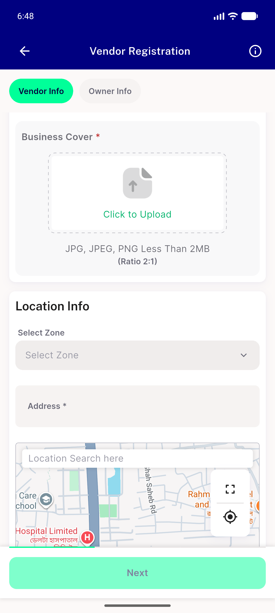
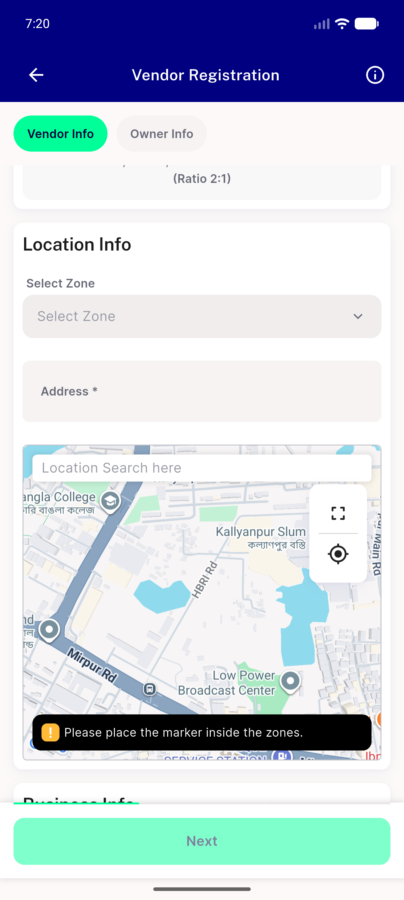
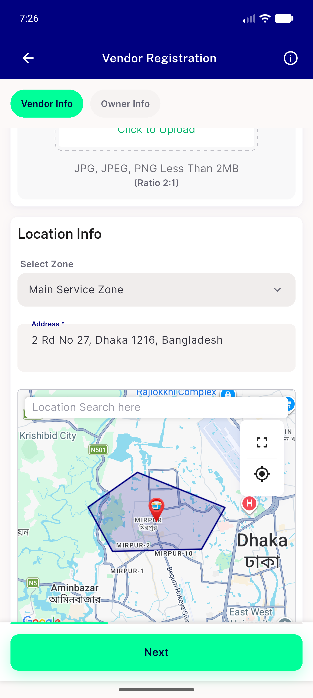
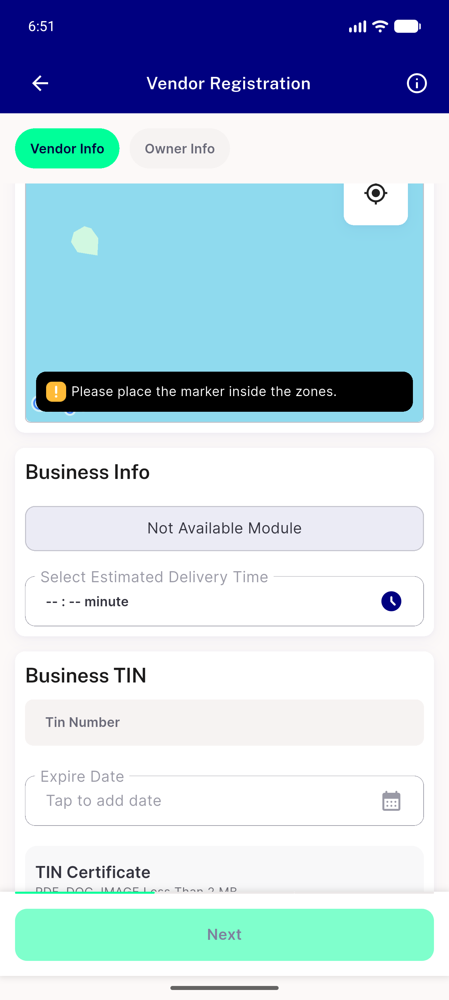

# QA Evidence — NEARS-2283

**PASS — manual zone pick survives camera idle, AC1-3 live-verified emulator-5562**

**8 screenshot(s).** Click any thumbnail for full resolution.

<table>
<tr>
<td align="center" width="33%"> ac1 abudhabi pick settled</td>
<td align="center" width="33%"> ac1 abudhabi pick survives 2s past lock</td>
<td align="center" width="33%"> ac1 ac3 abudhabi modules loaded</td>
</tr>
<tr>
<td align="center" width="33%"> ac1 ac3 mainservicezone pick settled</td>
<td align="center" width="33%"> ac1 start camera outside zones</td>
<td align="center" width="33%"> ac2 genuine camera move autodetect noprior pick</td>
</tr>
<tr>
<td align="center" width="33%"> ac2 genuine idle refreshes inzone after lock</td>
<td align="center" width="33%"> oneshot genuine pan after guarded idle resets cleanly</td>
</tr>
</table>

### Other artifacts
- [`dump-map-bounds-for-drag-calc.xml`](dump-map-bounds-for-drag-calc.xml)

---
*From `nears/docs/qa-evidence/NEARS-2283/` · public-repo scrub policy (no live secrets; verified clean).*
