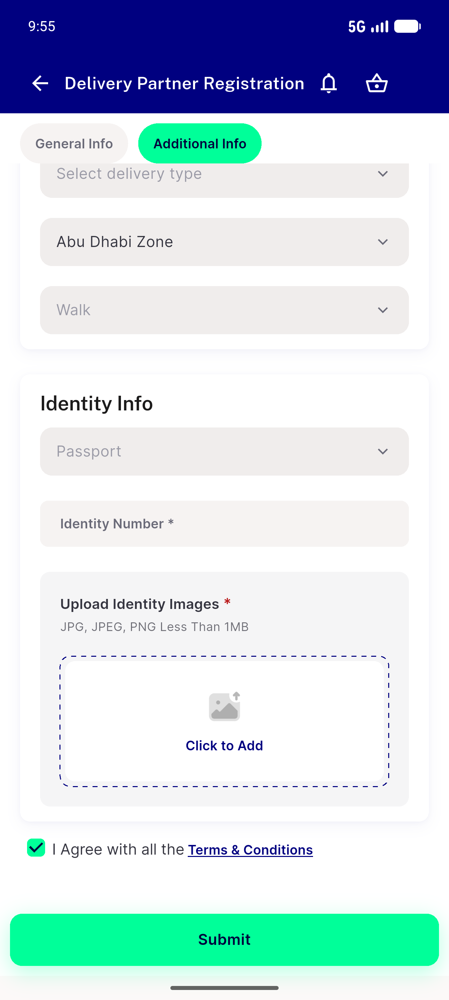

# QA Evidence — NEARS-2284

**PASS: AC1 (unit+static) PASS cycle-0, AC2 (live zone dropdown) PASS cycle-2 on emulator-5556, regression-sweep-scope PASS**

**1 screenshot(s).** Click any thumbnail for full resolution.

<table>
<tr>
<td align="center" width="33%"> ac2 zone dropdown populated</td>
</tr>
</table>

### Other artifacts
- [`progress.md`](progress.md)

---
*From `nears/docs/qa-evidence/NEARS-2284/` · public-repo scrub policy (no live secrets; verified clean).*
