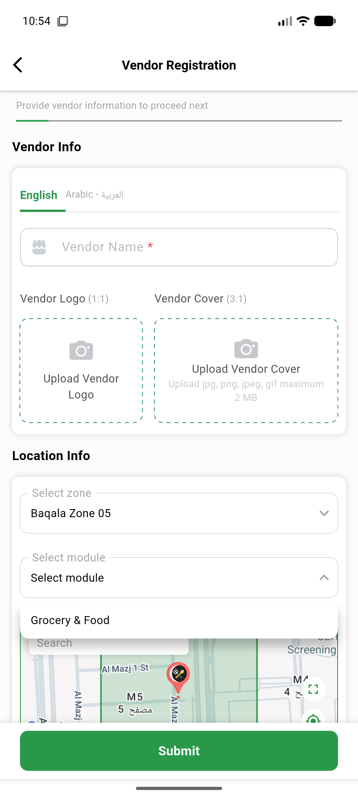
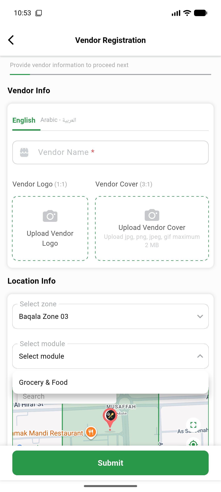

# QA Evidence — NEARS-2285

**PASS — VendorApp AddressController module zone race guard verified live on emulator-5554 (Android)**

**2 screenshot(s).** Click any thumbnail for full resolution.

<table>
<tr>
<td align="center" width="33%"> ac1 rapid double switch baqala05 final</td>
<td align="center" width="33%"> regression single zone baqala03 modules</td>
</tr>
</table>

---
*From `nears/docs/qa-evidence/NEARS-2285/` · public-repo scrub policy (no live secrets; verified clean).*
