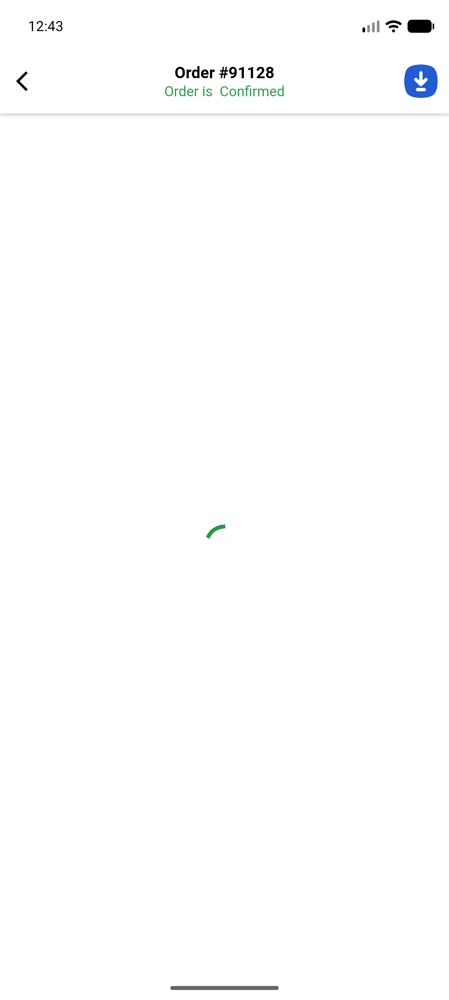
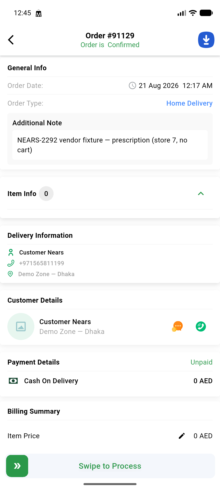
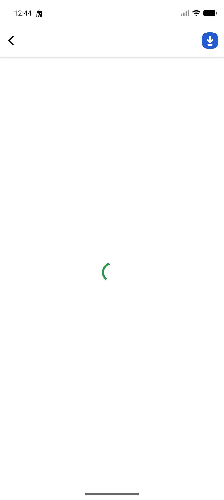

# QA Evidence — NEARS-2292

**PASS — order 91128 (parcel) reachable via VendorApp for demo.store@gmail.com, order 91129 (prescription, 0 cart lines) reachable+renders for sara.ali@demo.com, POS order 91130 returned by GET /api/v1/vendor/pos/orders, regression spot-check clean**

**3 screenshot(s).** Click any thumbnail for full resolution.

<table>
<tr>
<td align="center" width="33%"> ac1 order 91128 detail</td>
<td align="center" width="33%"> ac2 order 91129 detail</td>
<td align="center" width="33%"> bug untranslated order not found</td>
</tr>
</table>

---
*From `nears/docs/qa-evidence/NEARS-2292/` · public-repo scrub policy (no live secrets; verified clean).*
