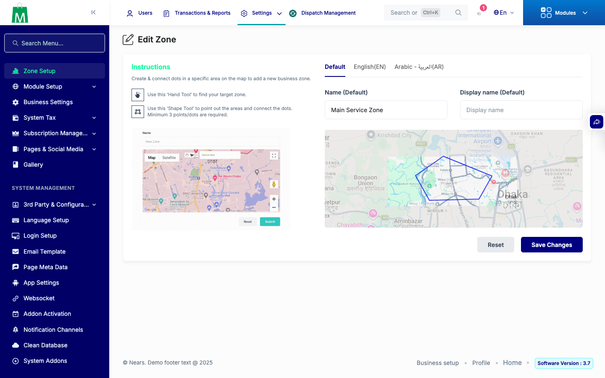

# QA Evidence — NEARS-2293

**PASS — zone/module leak allow-list verified live on patched worktree; API_HOST override for UserApp iOS, VendorApp untouched by fix (code-audit); Android pool exhausted + iOS Pods env gap noted**

**1 screenshot(s).** Click any thumbnail for full resolution.

<table>
<tr>
<td align="center" width="33%"> ac5 admin zone edit</td>
</tr>
</table>

### Other artifacts
- [`ac1-2-3-module-response.json`](ac1-2-3-module-response.json)
- [`ac4-zone-scoping-live.txt`](ac4-zone-scoping-live.txt)
- [`ac5-admin-zone-edit-coordinates.txt`](ac5-admin-zone-edit-coordinates.txt)
- [`get-zone-id-response.json`](get-zone-id-response.json)
- [`phpunit-backstop.txt`](phpunit-backstop.txt)

---
*From `nears/docs/qa-evidence/NEARS-2293/` · public-repo scrub policy (no live secrets; verified clean).*
