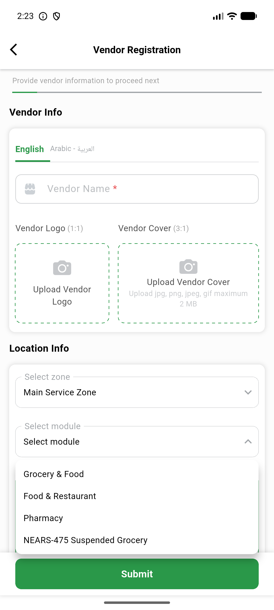
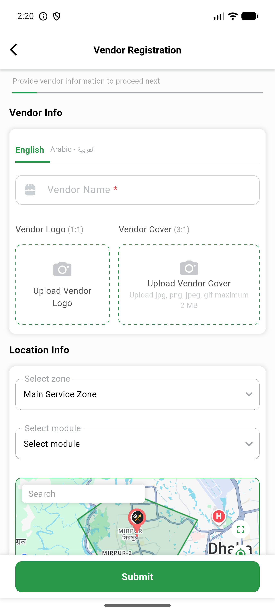

# QA Evidence — NEARS-2295

**PASS - VendorApp empty-module dropdown gate, AC1 unit-test evidence + AC2/AC3 live**

**2 screenshot(s).** Click any thumbnail for full resolution.

<table>
<tr>
<td align="center" width="33%"> ac2 dropdown open</td>
<td align="center" width="33%"> ac2 registration screen</td>
</tr>
</table>

---
*From `nears/docs/qa-evidence/NEARS-2295/` · public-repo scrub policy (no live secrets; verified clean).*
