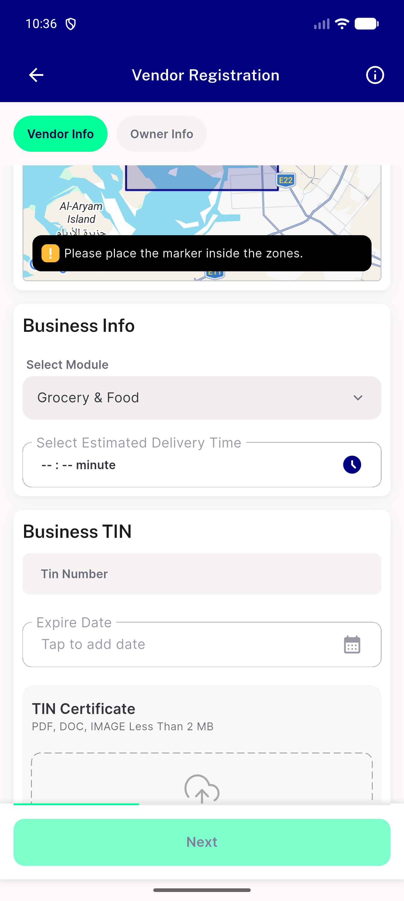

# QA Evidence — NEARS-2299

**PASS — UserApp NEARS-2299 zone-id null guard, emulator-5554, 3/3 unit tests + mutation-verified, AC3 live device confirmed**

**1 screenshot(s).** Click any thumbnail for full resolution.

<table>
<tr>
<td align="center" width="33%"> ac3 module dropdown populated</td>
</tr>
</table>

---
*From `nears/docs/qa-evidence/NEARS-2299/` · public-repo scrub policy (no live secrets; verified clean).*
