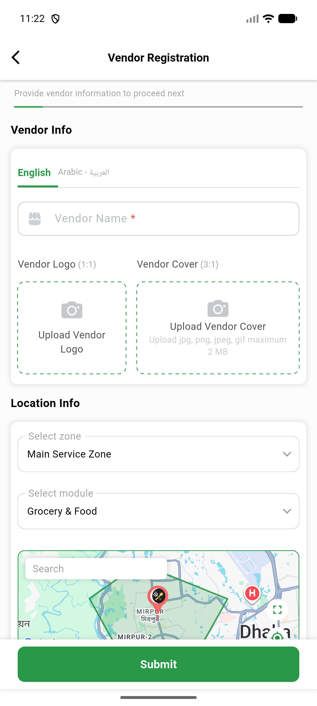

# QA Evidence — NEARS-2300

**PASS — AC3 live-demonstrated on emulator-5554, module list populates for non-null zoneId**

**1 screenshot(s).** Click any thumbnail for full resolution.

<table>
<tr>
<td align="center" width="33%"> ac3 module list populated</td>
</tr>
</table>

---
*From `nears/docs/qa-evidence/NEARS-2300/` · public-repo scrub policy (no live secrets; verified clean).*
