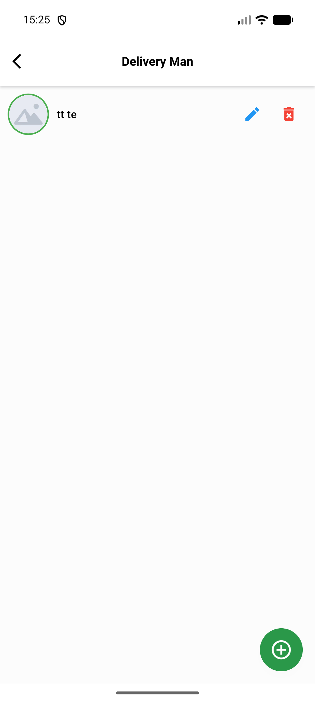
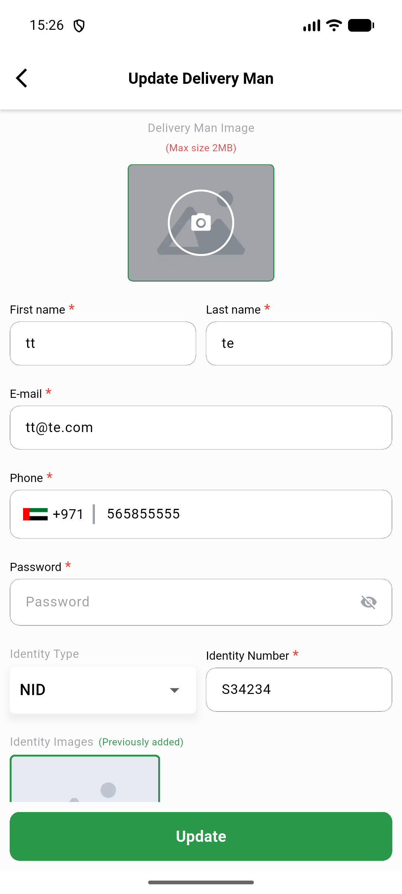
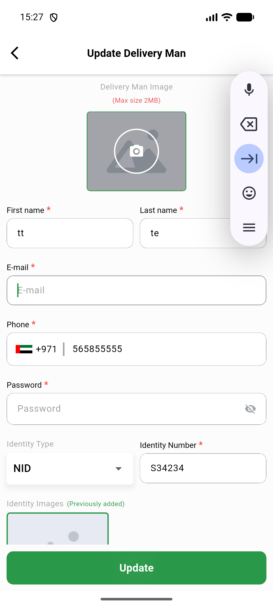

# QA Evidence — NEARS-2301

**delta re-QA AC4: env-blocked E2E, partial live evidence + widget-test corroboration — see comment**

**3 screenshot(s).** Click any thumbnail for full resolution.

<table>
<tr>
<td align="center" width="33%"> ac4 dm list renders</td>
<td align="center" width="33%"> ac4 edit screen populated unpatched backend</td>
<td align="center" width="33%"> ac4 empty email snackbar</td>
</tr>
</table>

### Other artifacts
- [`ac1-list-response.json`](ac1-list-response.json)
- [`ac2-preview-response.json`](ac2-preview-response.json)
- [`ac3-search-response.json`](ac3-search-response.json)
- [`ac4-baseurl-routing-blocker.log`](ac4-baseurl-routing-blocker.log)
- [`ac4-device-pool-saturation.log`](ac4-device-pool-saturation.log)
- [`automated-backend-phpunit.log`](automated-backend-phpunit.log)
- [`automated-vendorapp-flutter-test.log`](automated-vendorapp-flutter-test.log)
- [`idor-preview-foreign-dm-404.json`](idor-preview-foreign-dm-404.json)

---
*From `nears/docs/qa-evidence/NEARS-2301/` · public-repo scrub policy (no live secrets; verified clean).*
