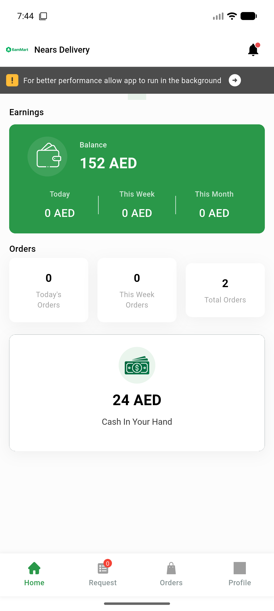

# QA Evidence — NEARS-2302

**PASS — dm.api header-auth landed: AC1/AC2/AC3 all demonstrated live; 22 app requests, 0 token leakage**

**1 screenshot(s).** Click any thumbnail for full resolution.

<table>
<tr>
<td align="center" width="33%"> ac3 deliveryapp logged in home</td>
</tr>
</table>

### Other artifacts
- [`ac1-ac2-auth-matrix.log`](ac1-ac2-auth-matrix.log)
- [`ac3-wire-tap.log`](ac3-wire-tap.log)
- [`bug-testdb-freshness-guard-concurrent.log`](bug-testdb-freshness-guard-concurrent.log)
- [`prefix-red-control.log`](prefix-red-control.log)

---
*From `nears/docs/qa-evidence/NEARS-2302/` · public-repo scrub policy (no live secrets; verified clean).*
