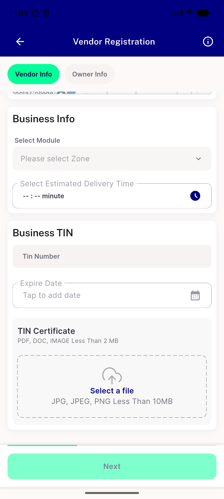
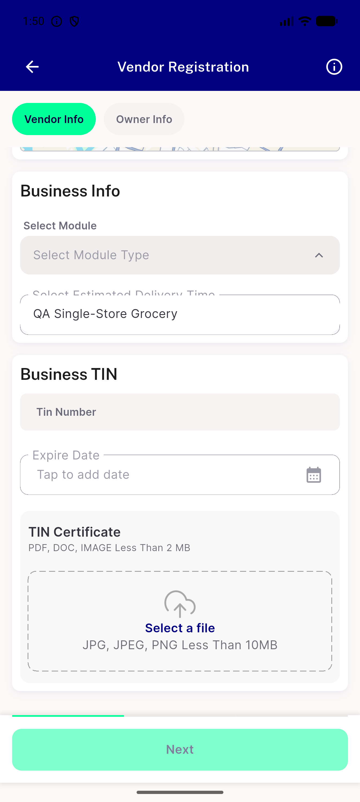
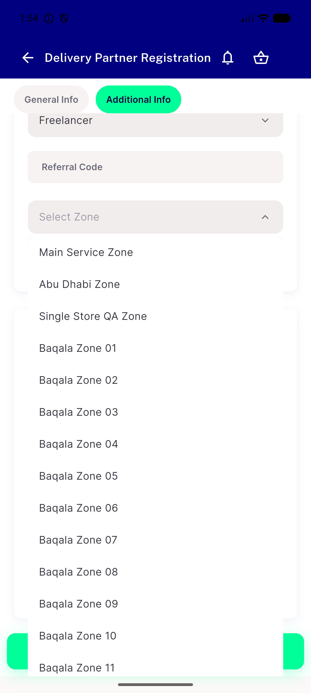
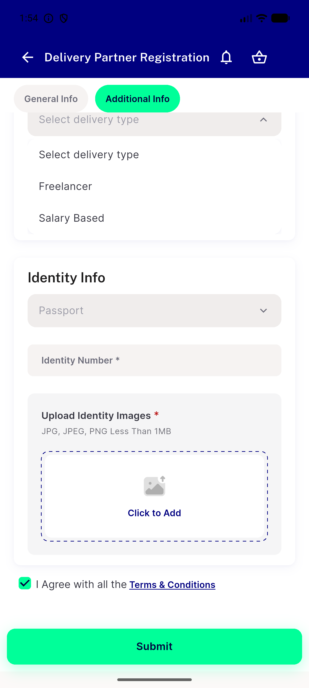
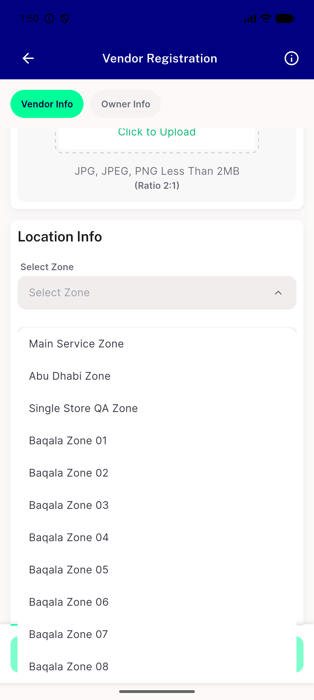

# QA Evidence — NEARS-2303

**PASS (cycle 2): AC1 static (cycle1) + AC2/AC3 live-demonstrated on emulator-5554 — module/zone/dm-type/dm-zone NSelects all render populated, never blank, at every reachable state; zero [FAIL]/[ERR] in session logs**

**6 screenshot(s).** Click any thumbnail for full resolution.

<table>
<tr>
<td align="center" width="33%"> ac2 module disabled zoneunselected hint</td>
<td align="center" width="33%"> ac2 module select populated</td>
<td align="center" width="33%"> ac3 dm zone select populated</td>
</tr>
<tr>
<td align="center" width="33%"> ac3 dmtype select populated</td>
<td align="center" width="33%"> ac3 zone select populated</td>
<td align="center" width="33%"> regression smoke additionalinfo</td>
</tr>
</table>

### Other artifacts
- [`progress.md`](progress.md)

---
*From `nears/docs/qa-evidence/NEARS-2303/` · public-repo scrub policy (no live secrets; verified clean).*
