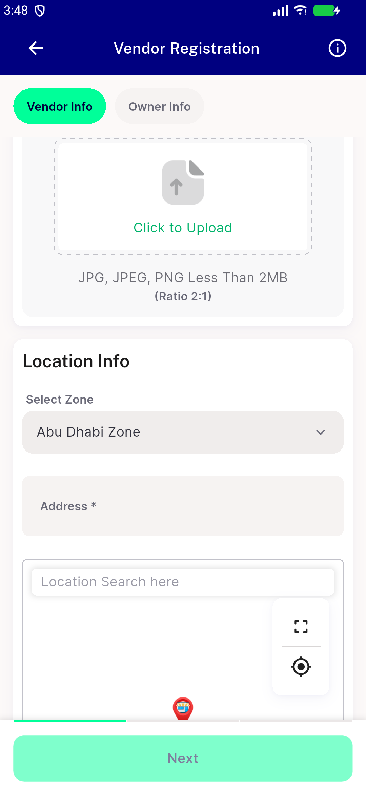
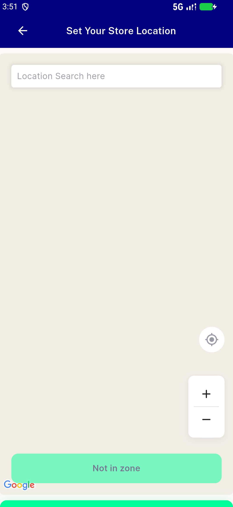
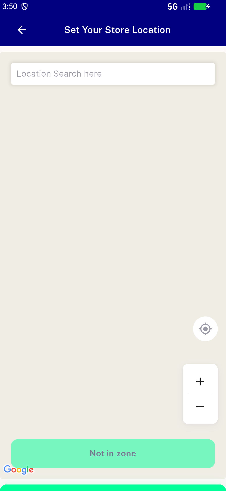

# QA Evidence — NEARS-2305

**PASS(core map-dup fix)+FAIL(zone-state regression on picker reopen) — emulator-5556, ef311a01**

**3 screenshot(s).** Click any thumbnail for full resolution.

<table>
<tr>
<td align="center" width="33%"> ac2 embedded restored</td>
<td align="center" width="33%"> bug zone state lost on picker reopen 12s nosettle</td>
<td align="center" width="33%"> bug zone state lost on picker reopen</td>
</tr>
</table>

### Other artifacts
- [`bug-embedded-next-disabled-after-reopen.xml`](bug-embedded-next-disabled-after-reopen.xml)
- [`bug-zone-state-lost-on-picker-reopen.xml`](bug-zone-state-lost-on-picker-reopen.xml)

---
*From `nears/docs/qa-evidence/NEARS-2305/` · public-repo scrub policy (no live secrets; verified clean).*
