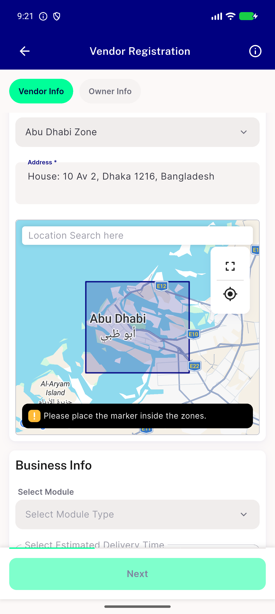
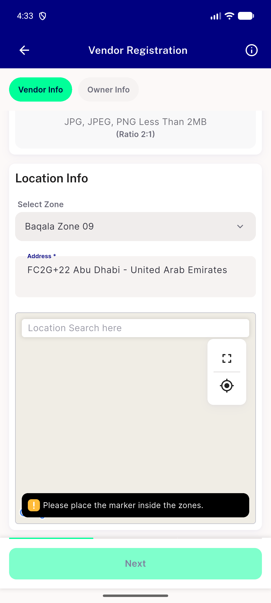
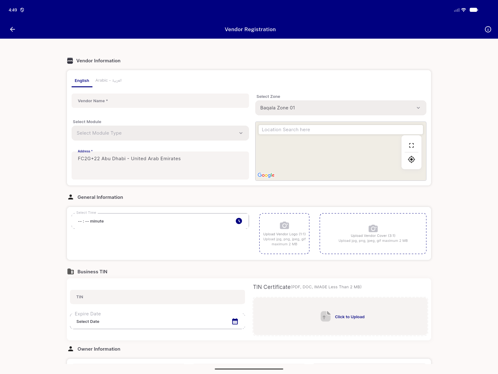
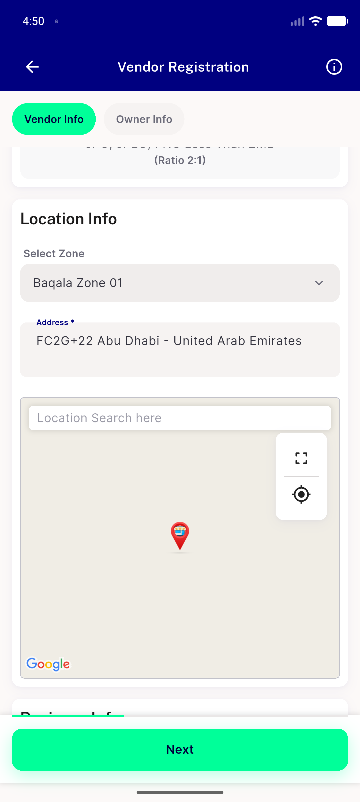

# QA Evidence — NEARS-2305

**Add control-repro log isolating the pre-existing self-correction freeze from the TB-2305-2 fix**

**6 screenshot(s).** Click any thumbnail for full resolution.

<table>
<tr>
<td align="center" width="33%"> bug combo restore grace steals suppress idle</td>
<td align="center" width="33%"> bug mapcontroller disposed crash</td>
<td align="center" width="33%"> control no restore plain dropdown pick</td>
</tr>
<tr>
<td align="center" width="33%"> delta reopen clean desktop</td>
<td align="center" width="33%"> pass desktop webview pick after restore</td>
<td align="center" width="33%"> pass mobile pick after restore not frozen on restored zone</td>
</tr>
</table>

### Other artifacts
- [`bug-mapcontroller-disposed-crash.log`](bug-mapcontroller-disposed-crash.log)
- [`control-no-restore-plain-dropdown-pick-dump.xml`](control-no-restore-plain-dropdown-pick-dump.xml)
- [`regression-candidate-getzoneid-race.log`](regression-candidate-getzoneid-race.log)
- [`regression-selfcorrect-freeze-no-restore-control.log`](regression-selfcorrect-freeze-no-restore-control.log)

---
*From `nears/docs/qa-evidence/NEARS-2305/` · public-repo scrub policy (no live secrets; verified clean).*
