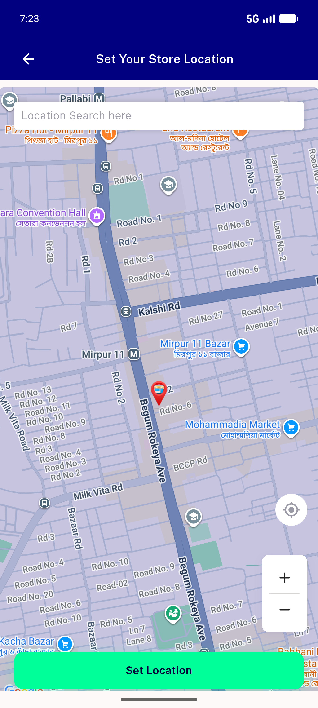
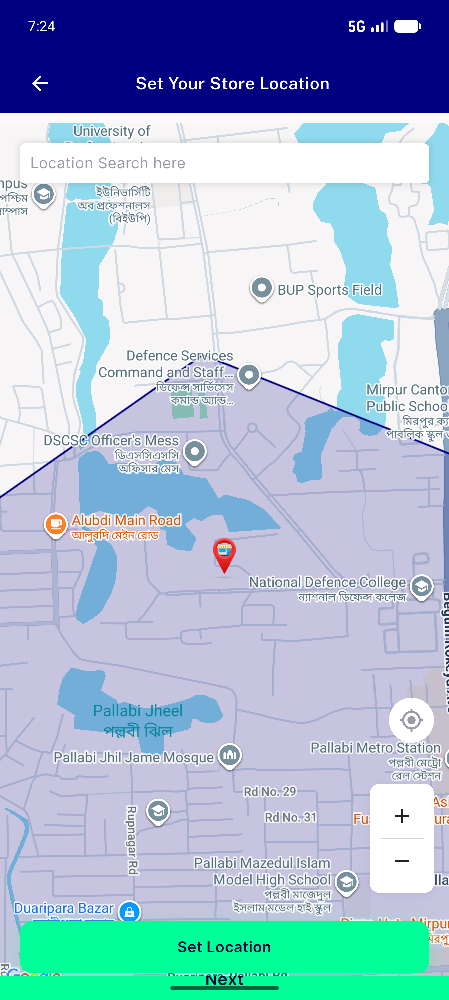
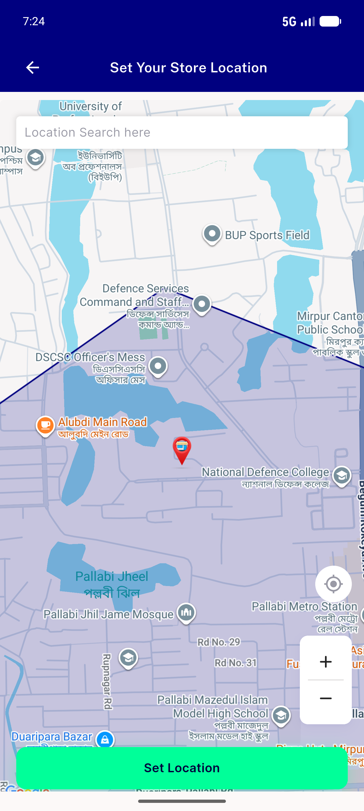

# QA Evidence — NEARS-2306

**QA PASS — setLocation monotonic request token guard confirmed live (338/338 auto)**

**3 screenshot(s).** Click any thumbnail for full resolution.

<table>
<tr>
<td align="center" width="33%"> ac1 fullscreen map before pan</td>
<td align="center" width="33%"> ac3 embedded address final state</td>
<td align="center" width="33%"> ac3 fullscreen map after rapid pan</td>
</tr>
</table>

### Other artifacts
- [`ac1-ac3-dual-dispatch-log-excerpt.log`](ac1-ac3-dual-dispatch-log-excerpt.log)

---
*From `nears/docs/qa-evidence/NEARS-2306/` · public-repo scrub policy (no live secrets; verified clean).*
