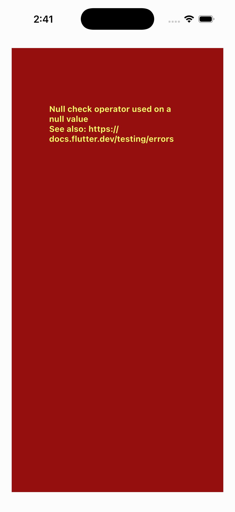

# QA Evidence — NEARS-2307

**BLOCKED: Android pool saturated + iOS blocked by pre-existing sign-in crash / no TCC accessibility on host**

**1 screenshot(s).** Click any thumbnail for full resolution.

<table>
<tr>
<td align="center" width="33%"> bug ios signin configmodel null crash</td>
</tr>
</table>

### Other artifacts
- [`bug-ios-signin-configmodel-null-crash.log`](bug-ios-signin-configmodel-null-crash.log)

---
*From `nears/docs/qa-evidence/NEARS-2307/` · public-repo scrub policy (no live secrets; verified clean).*
