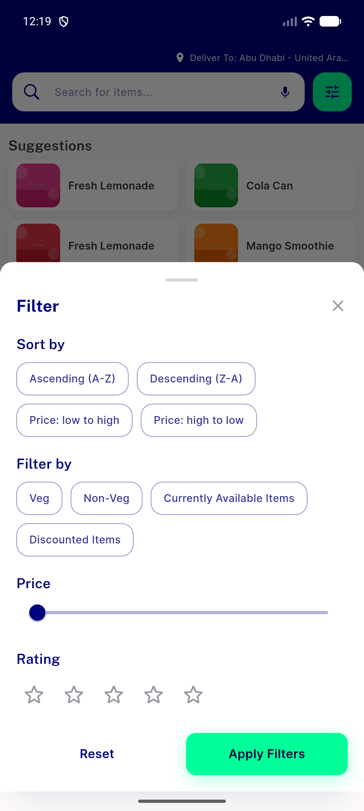
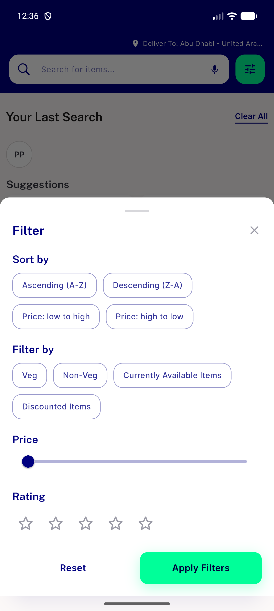

# QA Evidence — NEARS-2310

**PASS - AC1/AC2 + regression sweep, emulator-5554**

**6 screenshot(s).** Click any thumbnail for full resolution.

<table>
<tr>
<td align="center" width="33%"> ac1 ar fresh open</td>
<td align="center" width="33%"> ac1 en baseline</td>
<td align="center" width="33%"> ac2 live flip sheet still open</td>
</tr>
<tr>
<td align="center" width="33%"> regression en unchanged</td>
<td align="center" width="33%"> regression sort index persisted</td>
<td align="center" width="33%"> regression sort select ar</td>
</tr>
</table>

---
*From `nears/docs/qa-evidence/NEARS-2310/` · public-repo scrub policy (no live secrets; verified clean).*
