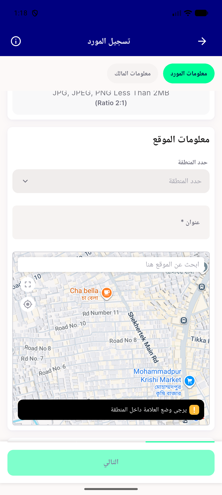

# QA Evidence — NEARS-2319

**PASS - RTL location-search hint mirrors correctly (pixel-measured), attempt 2**

**1 screenshot(s).** Click any thumbnail for full resolution.

<table>
<tr>
<td align="center" width="33%"> rtl location search hint mirrored</td>
</tr>
</table>

### Other artifacts
- [`blocked-device-pool-saturated.log`](blocked-device-pool-saturated.log)
- [`bug-locale-switch-reassemble-assertion.log`](bug-locale-switch-reassemble-assertion.log)

---
*From `nears/docs/qa-evidence/NEARS-2319/` · public-repo scrub policy (no live secrets; verified clean).*
