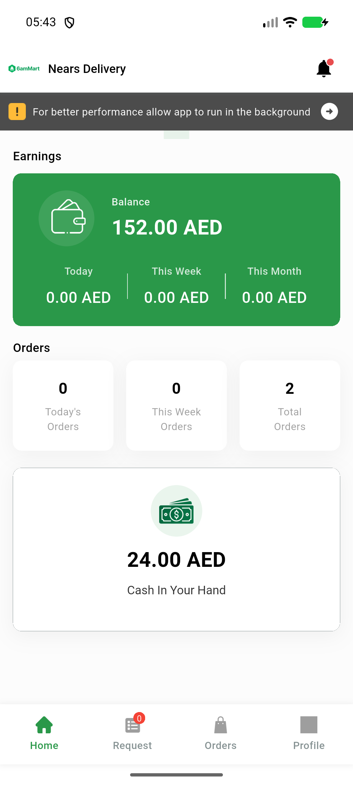

# QA Evidence — NEARS-2323

**PASS attempt2 - on-device install/launch/FA-init/Maps-key checks clean, emulator-5566**

**1 screenshot(s).** Click any thumbnail for full resolution.

<table>
<tr>
<td align="center" width="33%"> ac1 ac2 dashboard live</td>
</tr>
</table>

### Other artifacts
- [`ac1-ac2-ac3-ondevice-attempt2.log`](ac1-ac2-ac3-ondevice-attempt2.log)
- [`ac1-ac4-build-resource-proof.log`](ac1-ac4-build-resource-proof.log)

---
*From `nears/docs/qa-evidence/NEARS-2323/` · public-repo scrub policy (no live secrets; verified clean).*
