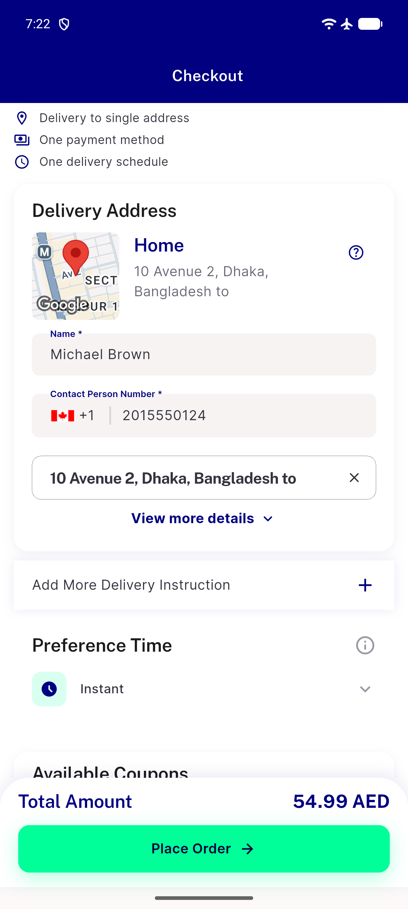
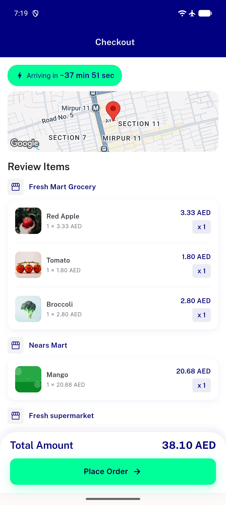
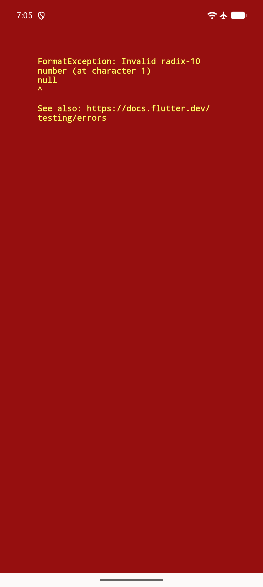
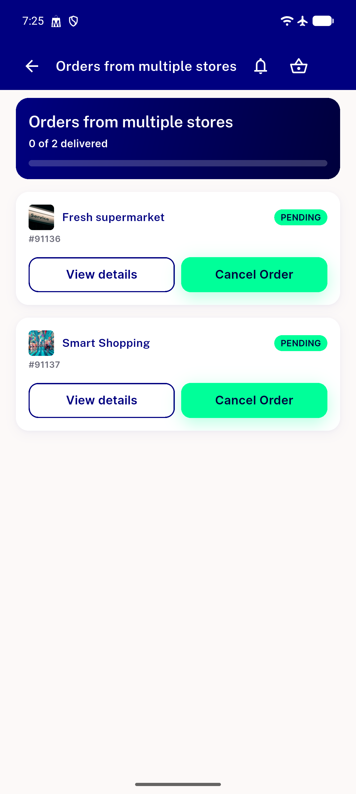

# QA Evidence — NEARS-2325

**PASS - checkout store-abort message: all 6 QA scope items demonstrated live (Pixel_10_Pro emulator-5554)**

**5 screenshot(s).** Click any thumbnail for full resolution.

<table>
<tr>
<td align="center" width="33%"> ac1 snackbar arabic rtl</td>
<td align="center" width="33%"> ac1 snackbar multi store</td>
<td align="center" width="33%"> ac1 snackbar single store</td>
</tr>
<tr>
<td align="center" width="33%"> bug checkout add address null zoneid crash</td>
<td align="center" width="33%"> regression multistore placement success</td>
</tr>
</table>

### Other artifacts
- [`ac1-snackbar-arabic-dump.xml`](ac1-snackbar-arabic-dump.xml)
- [`ac1-snackbar-multi-store-dump.xml`](ac1-snackbar-multi-store-dump.xml)
- [`bug-checkout-add-address-null-zoneid-crash.log`](bug-checkout-add-address-null-zoneid-crash.log)
- [`bug-tips-widget-renderflex-overflow.log`](bug-tips-widget-renderflex-overflow.log)

---
*From `nears/docs/qa-evidence/NEARS-2325/` · public-repo scrub policy (no live secrets; verified clean).*
