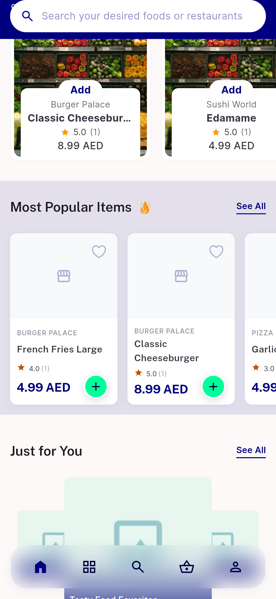
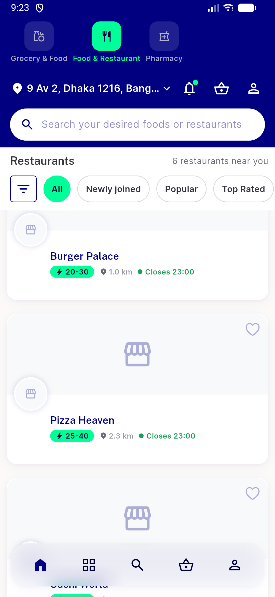
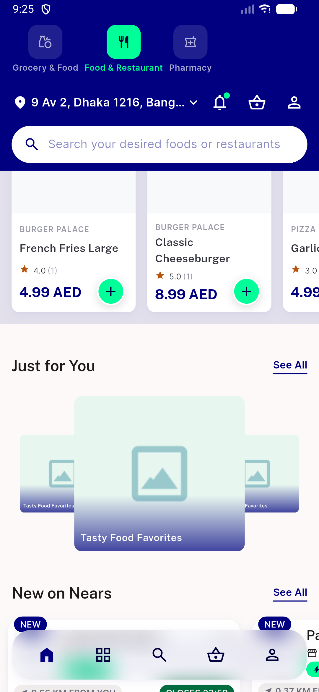
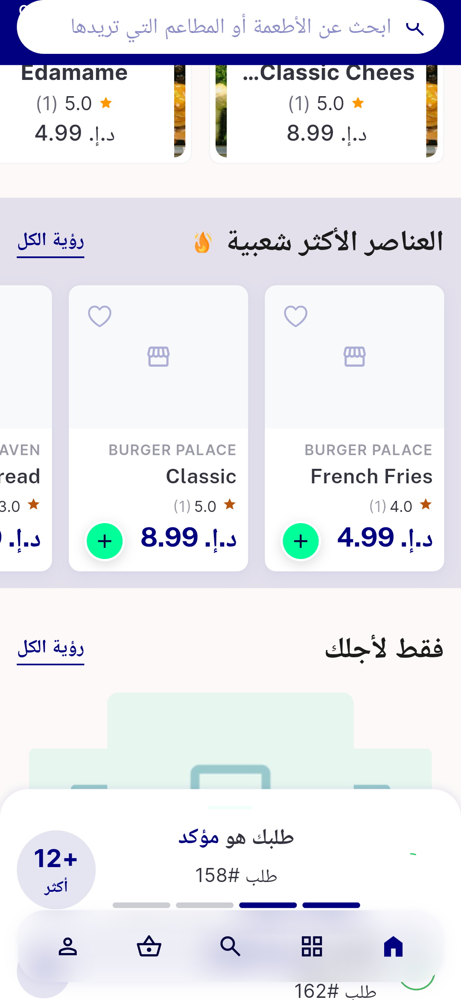
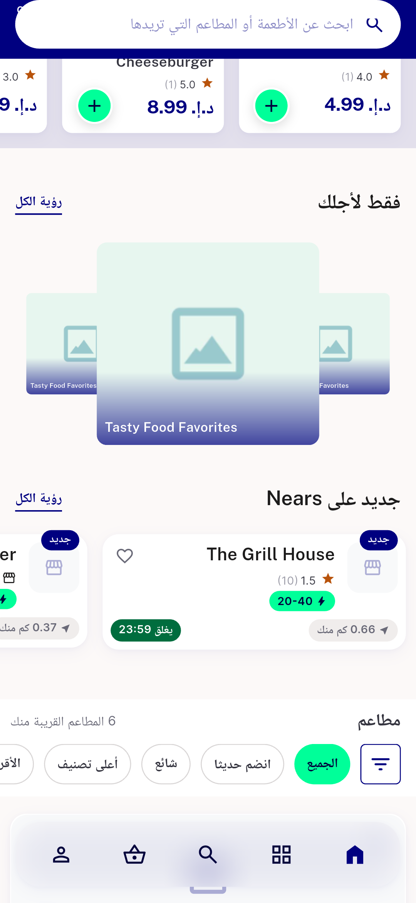

# QA Evidence — NEARS-2335

**PASS -- item-name label live on Just for You rail, matches ItemCampaignScreen; 2 findings filed (1 task_bug: RTL not mirrored due to pre-existing LTR wrapper; 1 regression_bug: item_bottom_sheet null-check crash, pre-existing)**

**11 screenshot(s).** Click any thumbnail for full resolution.

<table>
<tr>
<td align="center" width="33%"> ac2 just for you rail</td>
<td align="center" width="33%"> ac2 just for you rail2</td>
<td align="center" width="33%"> ac2 just for you refresh check2</td>
</tr>
<tr>
<td align="center" width="33%"> ac2 refresh check6</td>
<td align="center" width="33%"> ac3 rtl check1</td>
<td align="center" width="33%"> ac3 rtl check2</td>
</tr>
<tr>
<td align="center" width="33%"> ac4 textscale13 final</td>
<td align="center" width="33%"> bug item bottomsheet crash</td>
<td align="center" width="33%"> bug rtl label not mirrored</td>
</tr>
<tr>
<td align="center" width="33%"> regr carousel after</td>
<td align="center" width="33%"> regr carousel before</td>
</tr>
</table>

### Other artifacts
- [`bug-item-bottomsheet-nullcheck.log`](bug-item-bottomsheet-nullcheck.log)

---
*From `nears/docs/qa-evidence/NEARS-2335/` · public-repo scrub policy (no live secrets; verified clean).*
