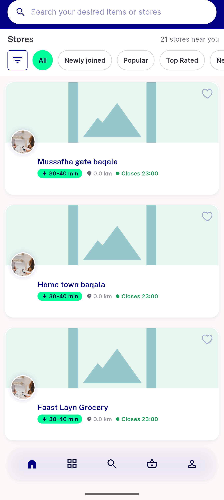
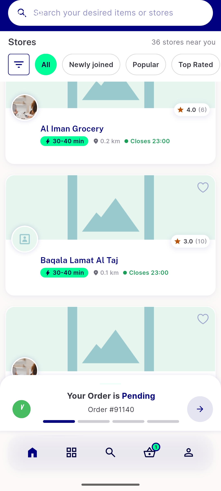
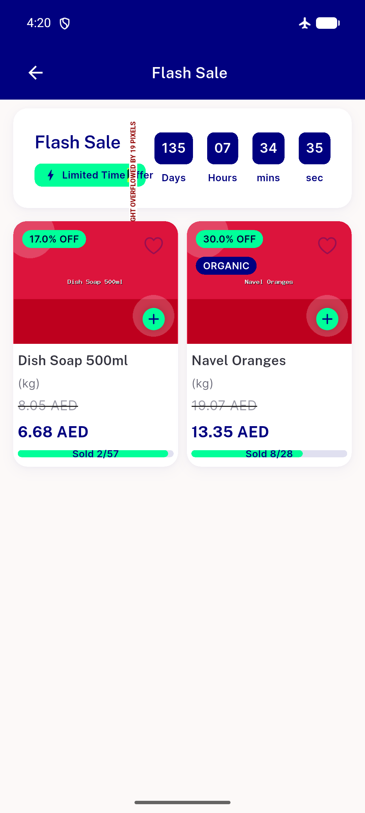
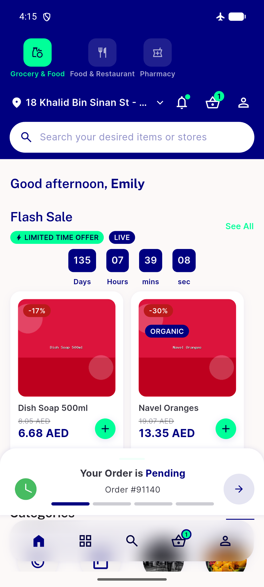

# QA Evidence — NEARS-2337

**QA PASS — module-home all-stores list burst-scroll freeze fixed, login-nudge defer verified, regression sweep clean (2 unrelated pre-existing bugs found)**

**8 screenshot(s).** Click any thumbnail for full resolution.

<table>
<tr>
<td align="center" width="33%"> ac1 post burst scroll</td>
<td align="center" width="33%"> ac1 slow scroll list exhausted</td>
<td align="center" width="33%"> ac2 coldstart scroll exhausted</td>
</tr>
<tr>
<td align="center" width="33%"> ac2 rebuild head 7880bf5d exhausted</td>
<td align="center" width="33%"> ac2 run1 final exhausted</td>
<td align="center" width="33%"> ac2 run2 final exhausted</td>
</tr>
<tr>
<td align="center" width="33%"> bug flash sale overflow</td>
<td align="center" width="33%"> scroll check1</td>
</tr>
</table>

### Other artifacts
- [`ac2-run3-netlog.txt`](ac2-run3-netlog.txt)
- [`bug-flash-sale-overflow.log`](bug-flash-sale-overflow.log)
- [`bug-update-interest-403.log`](bug-update-interest-403.log)

---
*From `nears/docs/qa-evidence/NEARS-2337/` · public-repo scrub policy (no live secrets; verified clean).*
