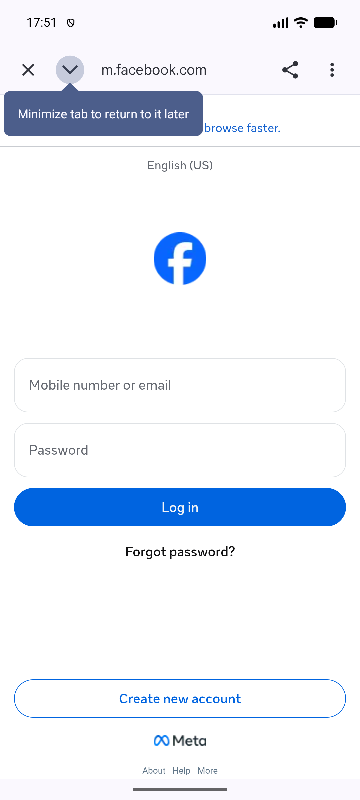
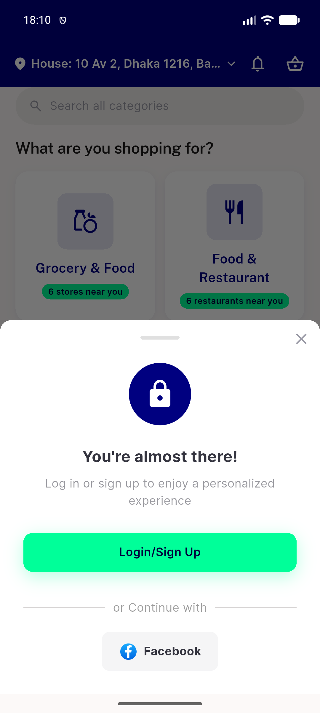
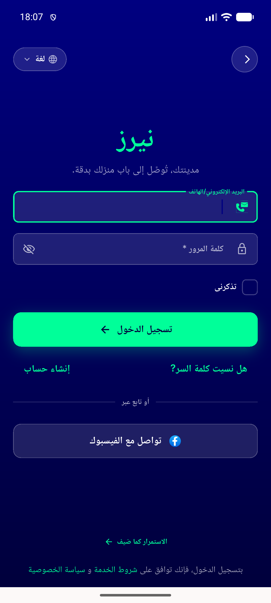
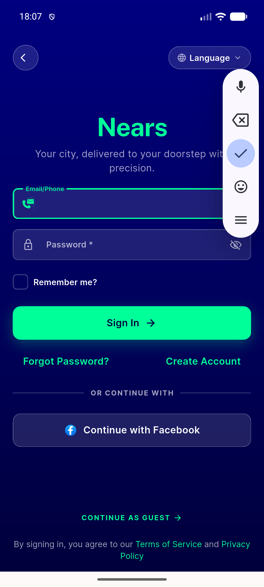

# QA Evidence — NEARS-2343

**PASS — Facebook login failure surfaces via specific toast + AppLogger.failure; both call sites verified; dead App ID reproduced live against real Meta servers**

**4 screenshot(s).** Click any thumbnail for full resolution.

<table>
<tr>
<td align="center" width="33%"> facebook oauth real page dead appid</td>
<td align="center" width="33%"> login suggestion bottomsheet facebook option</td>
<td align="center" width="33%"> signin facebook button ar rtl</td>
</tr>
<tr>
<td align="center" width="33%"> signin facebook button en</td>
</tr>
</table>

### Other artifacts
- [`native-graphresponse-dead-appid.log`](native-graphresponse-dead-appid.log)

---
*From `nears/docs/qa-evidence/NEARS-2343/` · public-repo scrub policy (no live secrets; verified clean).*
