# QA Evidence — NEARS-2345

**PASS - zone pricing disclosure fix verified: raw pivot fields absent, delivery-quote endpoint correct+throttled, COD cap enforced both directions, VendorApp zone resolution unaffected**

**18 screenshot(s).** Click any thumbnail for full resolution.

<table>
<tr>
<td align="center" width="33%"><a href="ac-coupon-apply-backend-down.png">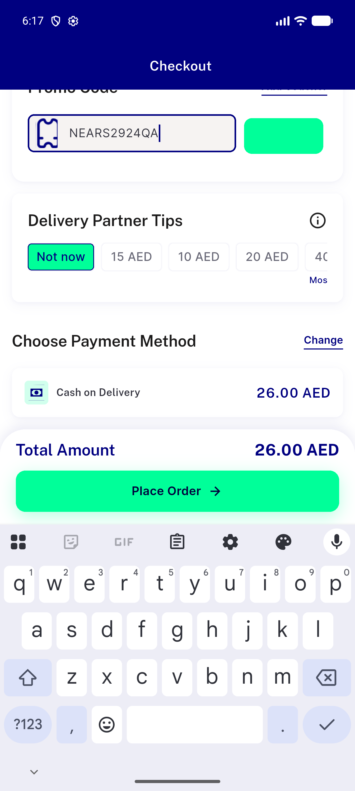</a> ac coupon apply backend down</td>
<td align="center" width="33%"><a href="ac-quote-fail-1.png">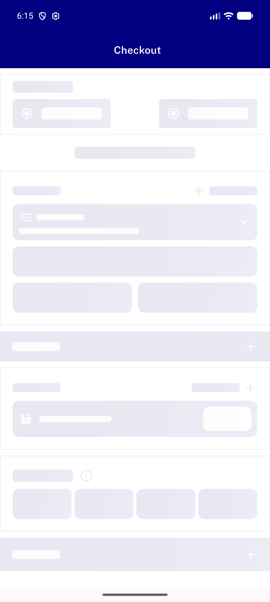</a> ac quote fail 1</td>
<td align="center" width="33%"><a href="ac-quote-fail-2.png">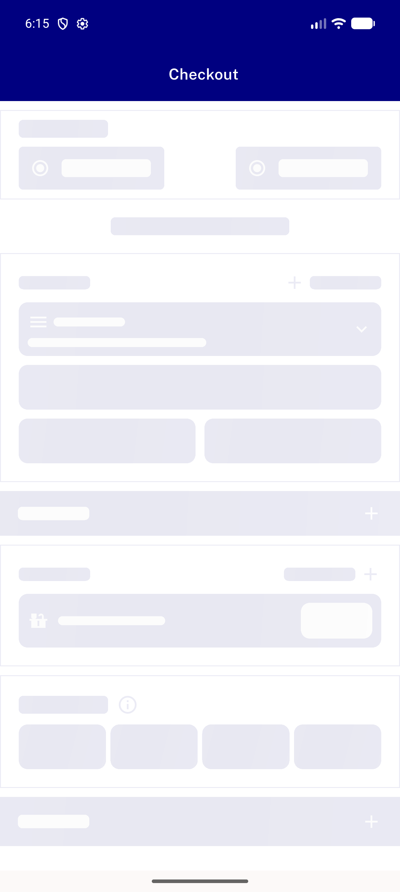</a> ac quote fail 2</td>
</tr>
<tr>
<td align="center" width="33%"><a href="ac-skeleton-or-fail-state.png">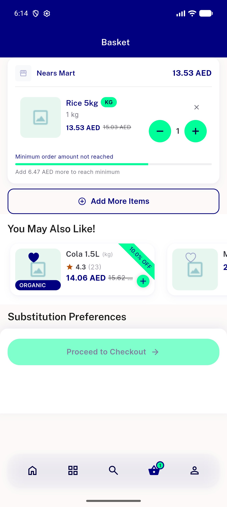</a> ac skeleton or fail state</td>
<td align="center" width="33%"><a href="ac2-bill-breakdown.png">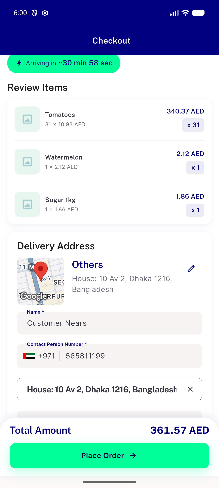</a> ac2 bill breakdown</td>
<td align="center" width="33%"><a href="ac2-checkout-total-under-cap.png">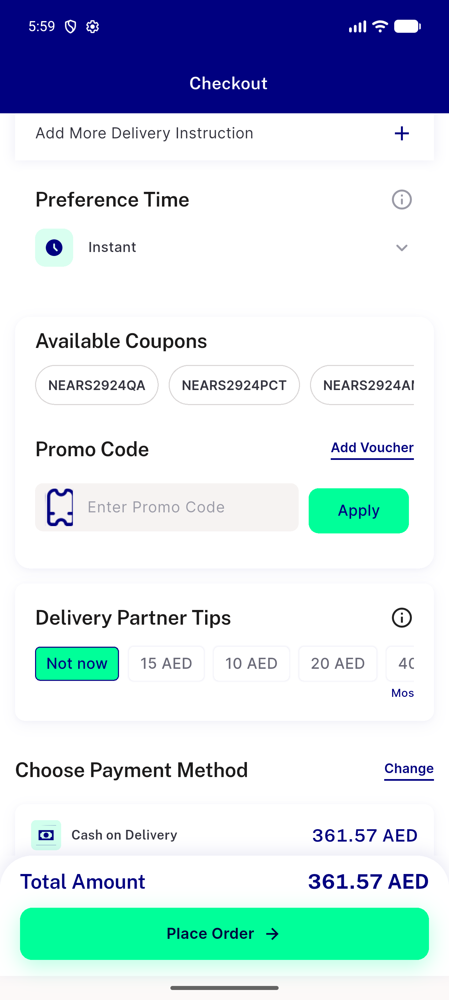</a> ac2 checkout total under cap</td>
</tr>
<tr>
<td align="center" width="33%"><a href="ac2-delivery-fee-row.png">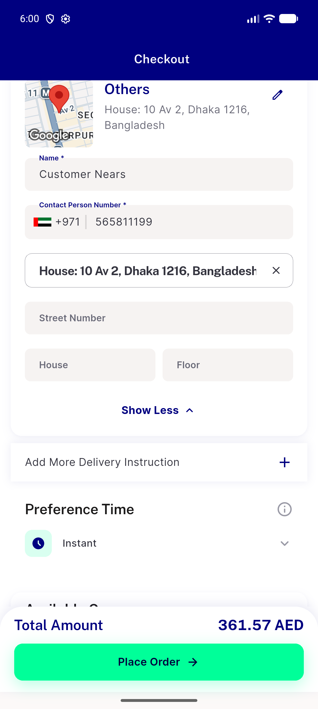</a> ac2 delivery fee row</td>
<td align="center" width="33%"><a href="ac3-over-cap-payment.png">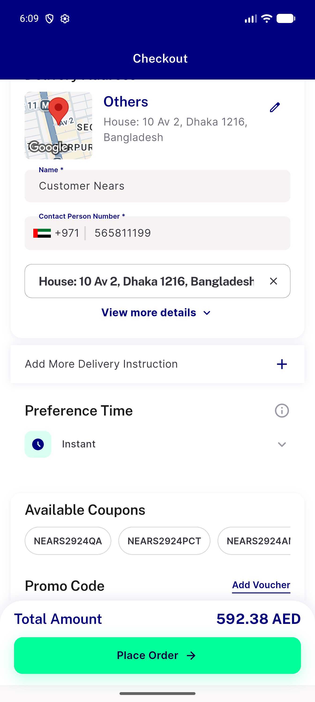</a> ac3 over cap payment</td>
<td align="center" width="33%"><a href="ac3-over-cap-payment2.png">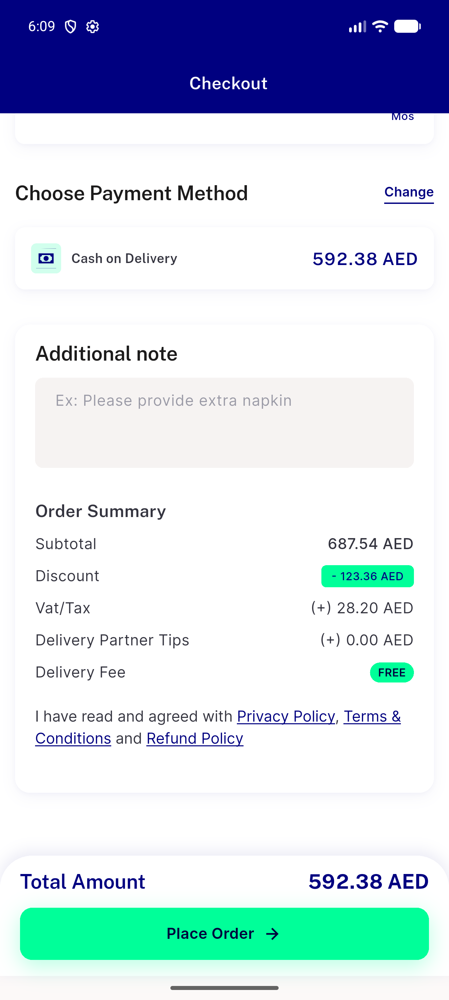</a> ac3 over cap payment2</td>
</tr>
<tr>
<td align="center" width="33%"><a href="ac3-place-order-tap.png">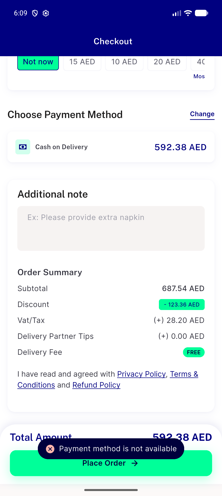</a> ac3 place order tap</td>
<td align="center" width="33%"><a href="ac3-under-cap-order-done.png">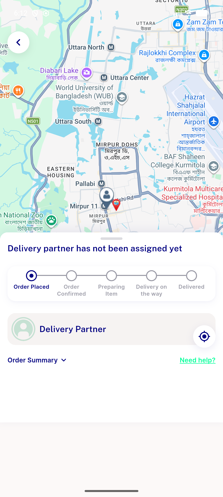</a> ac3 under cap order done</td>
<td align="center" width="33%"><a href="ac3-under-cap-order-result.png">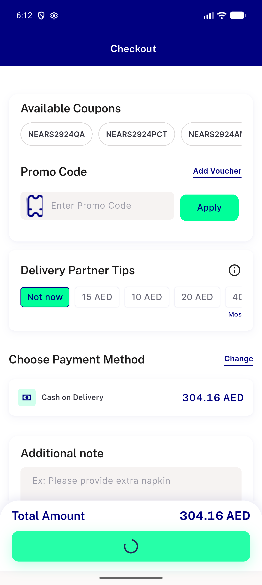</a> ac3 under cap order result</td>
</tr>
<tr>
<td align="center" width="33%"><a href="ac3-under-cap-summary.png">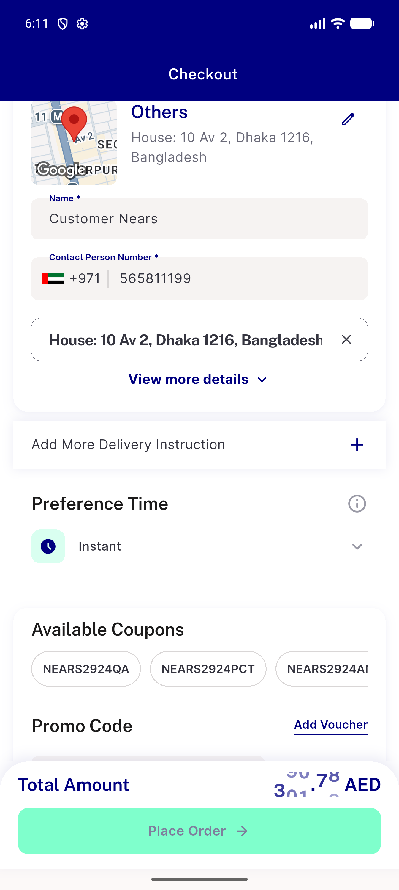</a> ac3 under cap summary</td>
<td align="center" width="33%"><a href="ac3-under-cap-summary2.png">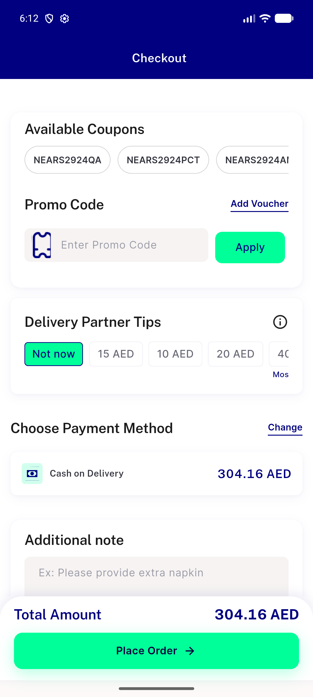</a> ac3 under cap summary2</td>
<td align="center" width="33%"><a href="ac5-vendorapp-zone-resolved.png">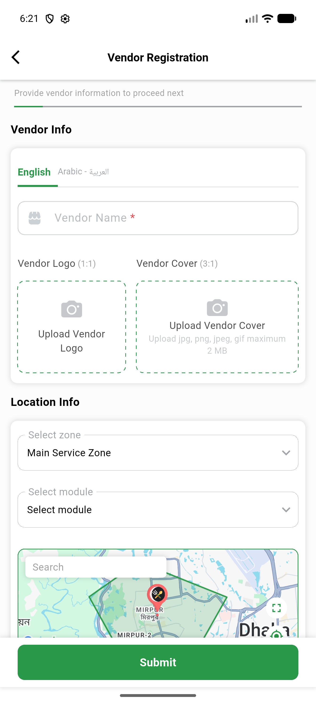</a> ac5 vendorapp zone resolved</td>
</tr>
<tr>
<td align="center" width="33%"><a href="gap-check-1scroll.png">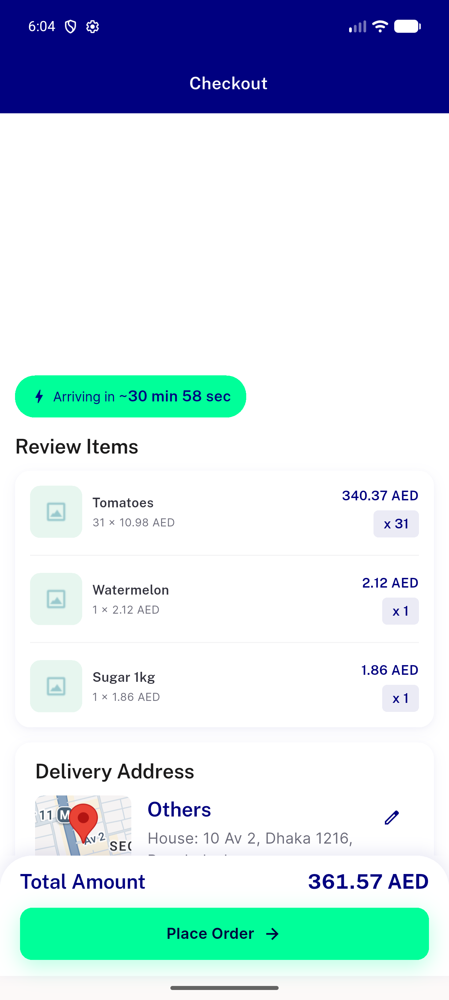</a> gap check 1scroll</td>
<td align="center" width="33%"><a href="scroll-top.png">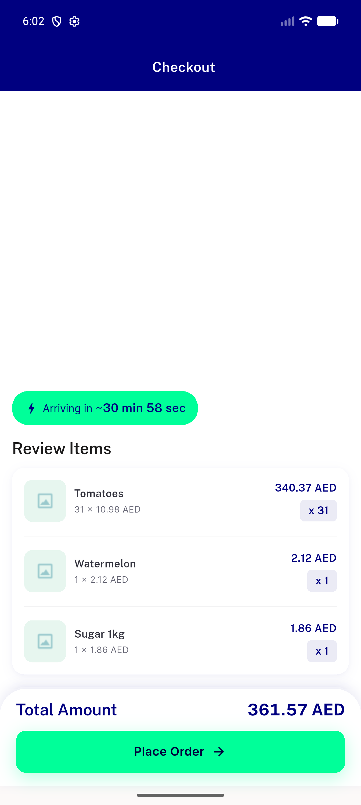</a> scroll top</td>
<td align="center" width="33%"><a href="total-tap.png">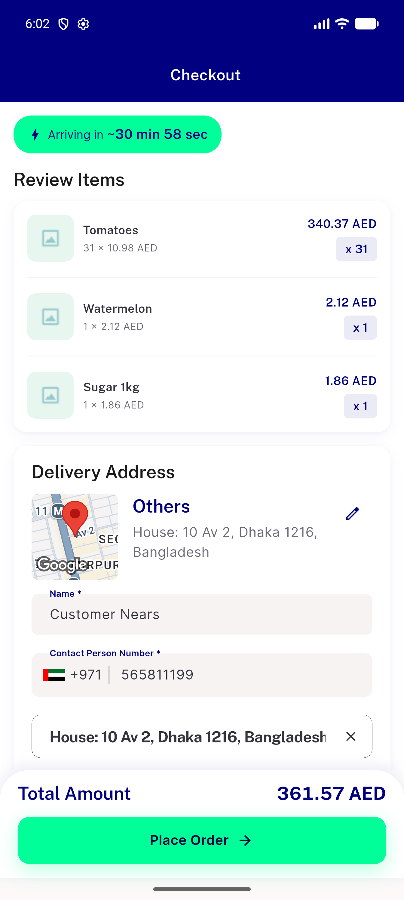</a> total tap</td>
</tr>
</table>

### Other artifacts
- [`checkout-missing-billsection-dump1.xml`](checkout-missing-billsection-dump1.xml)
- [`checkout-missing-billsection-dump2.xml`](checkout-missing-billsection-dump2.xml)

---
*From `nears/docs/qa-evidence/NEARS-2345/` · public-repo scrub policy (no live secrets; verified clean).*
