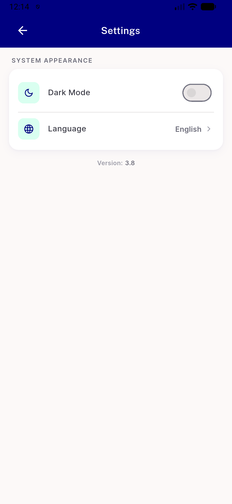
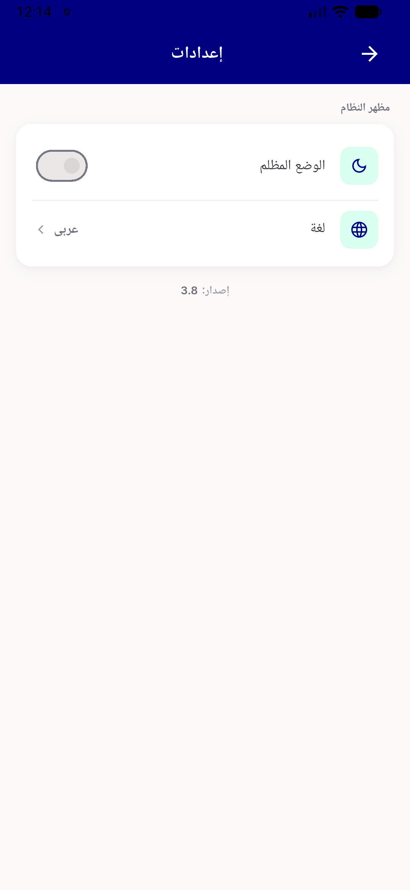
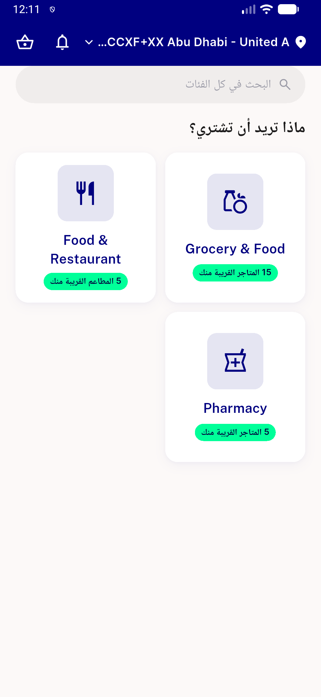

# QA Evidence — NEARS-2349

**PASS — all 3 setLanguage call sites re-verified live (device emulator-5564), EN<->AR RTL cycles clean, no debugCurrentBuildTarget assertion, flutter test 4236 green**

**4 screenshot(s).** Click any thumbnail for full resolution.

<table>
<tr>
<td align="center" width="33%"> callsite1 2 bottomsheet ar en settings</td>
<td align="center" width="33%"> callsite1 2 bottomsheet en ar settings</td>
<td align="center" width="33%"> callsite3 home ar rtl</td>
</tr>
<tr>
<td align="center" width="33%"> callsite3 nextcta en ar onboarding</td>
</tr>
</table>

---
*From `nears/docs/qa-evidence/NEARS-2349/` · public-repo scrub policy (no live secrets; verified clean).*
