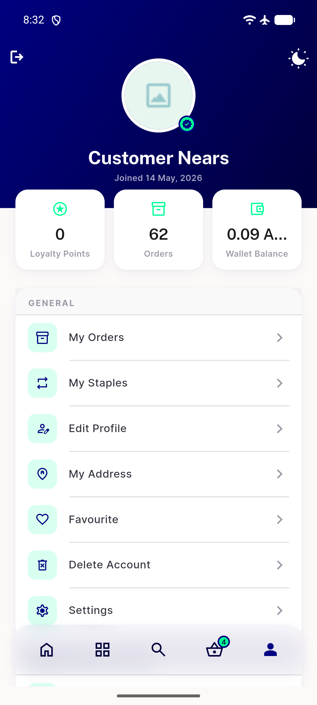
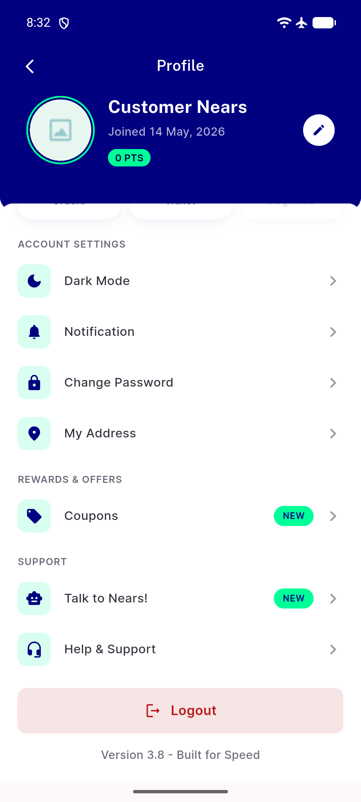
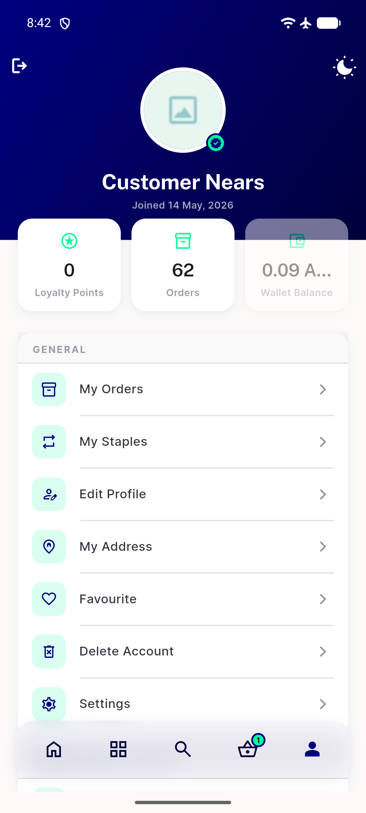
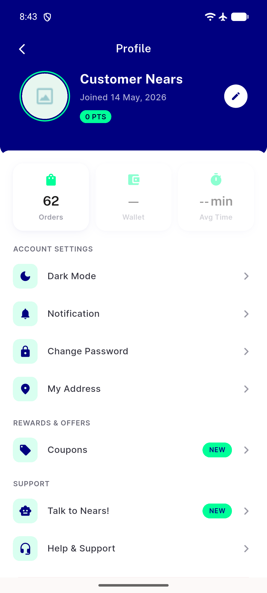
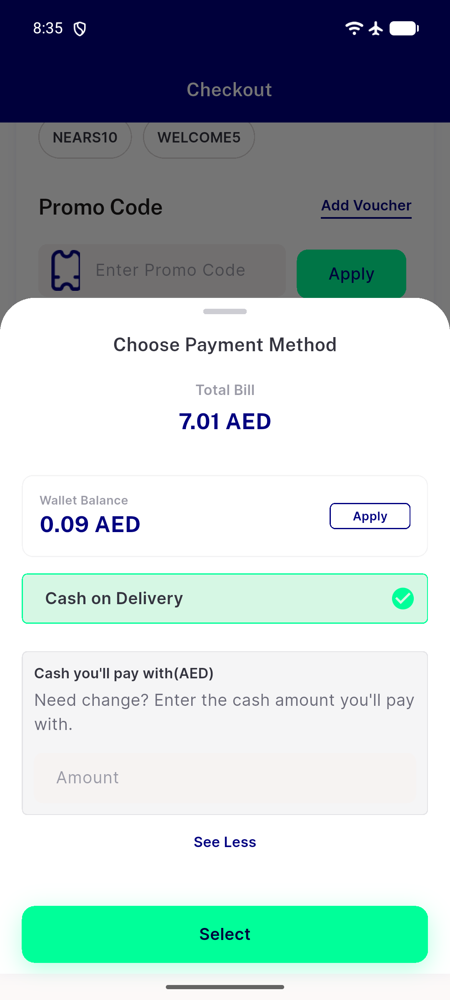

# QA Evidence — NEARS-2352

**PASS — Wallet screen reachable at current HEAD, no production code changed; regression test added and passing**

**5 screenshot(s).** Click any thumbnail for full resolution.

<table>
<tr>
<td align="center" width="33%"> ac1a menu stat tiles wallet on</td>
<td align="center" width="33%"> ac1b profile wallet screen</td>
<td align="center" width="33%"> ac2 menu stat tiles wallet off dimmed</td>
</tr>
<tr>
<td align="center" width="33%"> ac2 profile wallet off dimmed</td>
<td align="center" width="33%"> regression checkout payment method wallet on</td>
</tr>
</table>

---
*From `nears/docs/qa-evidence/NEARS-2352/` · public-repo scrub policy (no live secrets; verified clean).*
