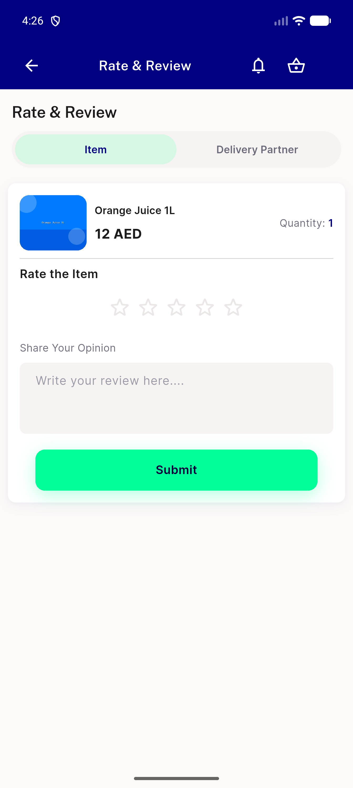
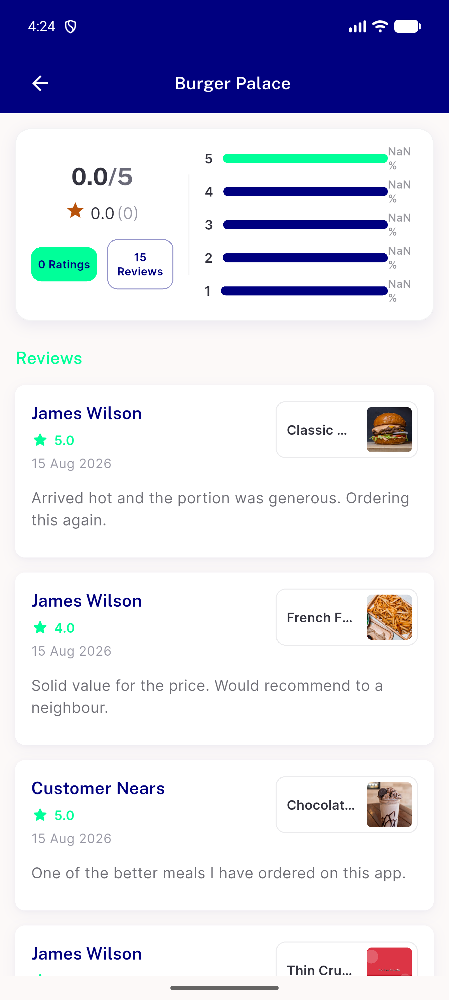

# QA Evidence — NEARS-2360

**PASS — automated backstop 0 failures (16 pinned tests, JSON-verified) + live device confirmation, emulator-5554**

**2 screenshot(s).** Click any thumbnail for full resolution.

<table>
<tr>
<td align="center" width="33%"> ac1 delivery man widget rate review</td>
<td align="center" width="33%"> ac2 review list mobile disabledcolor</td>
</tr>
</table>

---
*From `nears/docs/qa-evidence/NEARS-2360/` · public-repo scrub policy (no live secrets; verified clean).*
