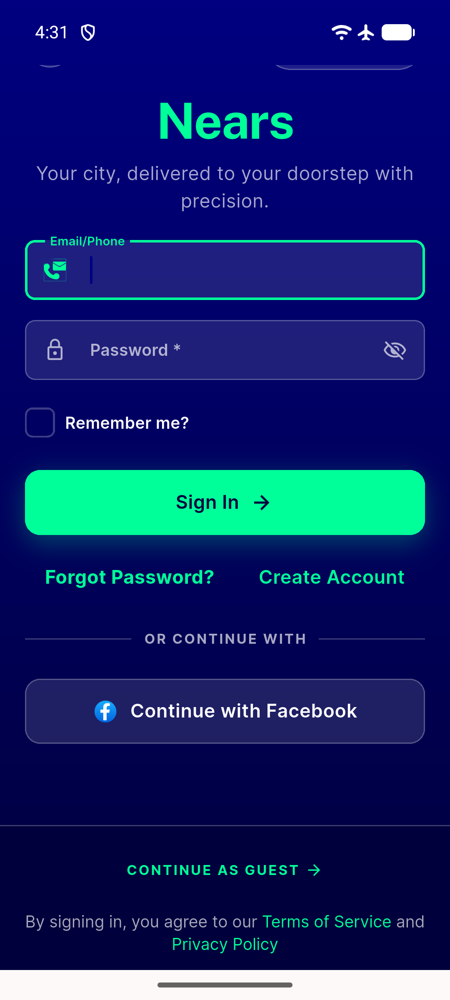

# QA Evidence — NEARS-2363

**PASS - AC2 regression confirmed (bottom sheet + sign-in Facebook buttons reachable, real Meta OAuth reached, no crash, graceful-cancel silent, failure/toast pairing proven by 3/3 widget test + 429/429 auth folder green); AC1 correctly descoped/skipped per owner decision**

**1 screenshot(s).** Click any thumbnail for full resolution.

<table>
<tr>
<td align="center" width="33%"> signin screen facebook button</td>
</tr>
</table>

### Other artifacts
- [`ac2-live-interaction-notes.log`](ac2-live-interaction-notes.log)
- [`coldstart-graphresponse-known-accepted.log`](coldstart-graphresponse-known-accepted.log)

---
*From `nears/docs/qa-evidence/NEARS-2363/` · public-repo scrub policy (no live secrets; verified clean).*
