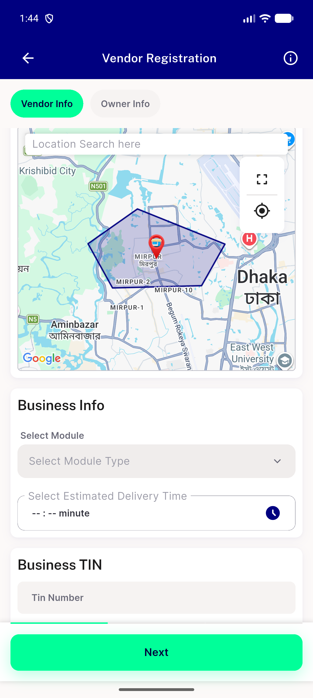
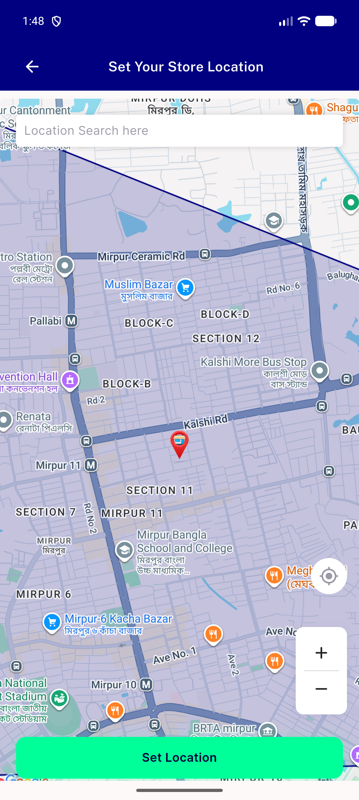
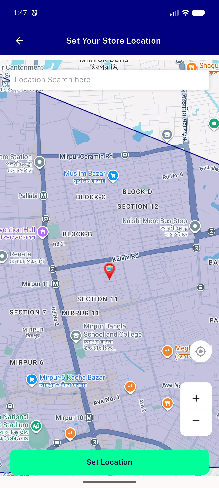
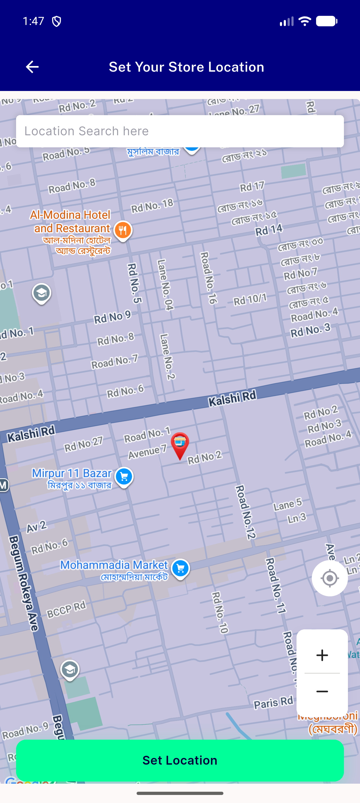

# QA Evidence — NEARS-2364

**PASS — NIconButtonCluster promotion, emulator-5570, all 6 ACs demonstrated live**

**6 screenshot(s).** Click any thumbnail for full resolution.

<table>
<tr>
<td align="center" width="33%"> ac1 fullscreen zoom cluster</td>
<td align="center" width="33%"> ac1 inline expand locate cluster</td>
<td align="center" width="33%"> ac3 zoomin after</td>
</tr>
<tr>
<td align="center" width="33%"> ac3 zoomin before</td>
<td align="center" width="33%"> ac3 zoomout after</td>
<td align="center" width="33%"> ac3 zoomout before</td>
</tr>
</table>

### Other artifacts
- [`ac4-a11y-dump-fullscreen.xml`](ac4-a11y-dump-fullscreen.xml)
- [`ac4-a11y-dump-inline.xml`](ac4-a11y-dump-inline.xml)

---
*From `nears/docs/qa-evidence/NEARS-2364/` · public-repo scrub policy (no live secrets; verified clean).*
