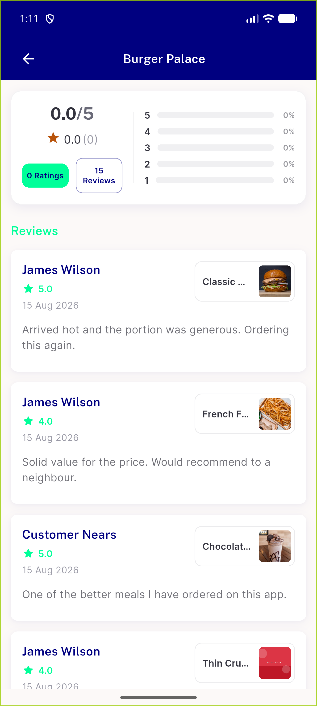
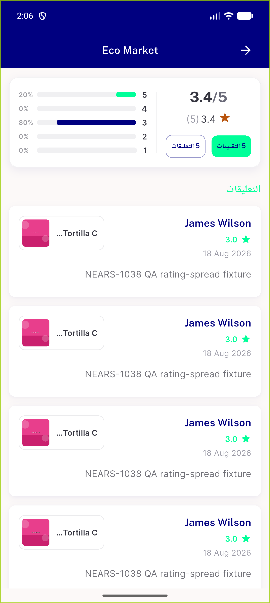

# QA Evidence — NEARS-2377

**AC1 + AC2 + AC3 all PASS, all live-verified (or automated-live-run for AC3). No shortcuts.**

**2 screenshot(s).** Click any thumbnail for full resolution.

<table>
<tr>
<td align="center" width="33%"> AC1 — Burger Palace, zero-sum histogram, all buckets 0%, no NaN%</td>
<td align="center" width="33%"> AC2 — Eco Market, non-zero histogram (5★20% 4★0% 3★80% 2★0% 1★0%), unchanged/correct</td>
</tr>
</table>

### Other artifacts
- [`progress.md`](progress.md)

---
*From `nears/docs/qa-evidence/NEARS-2377/` · public-repo scrub policy (no live secrets; verified clean).*
